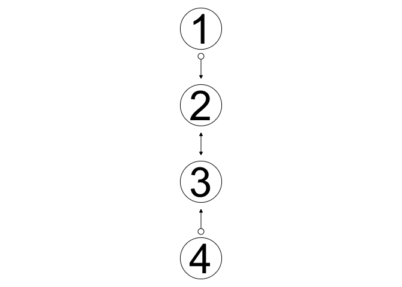
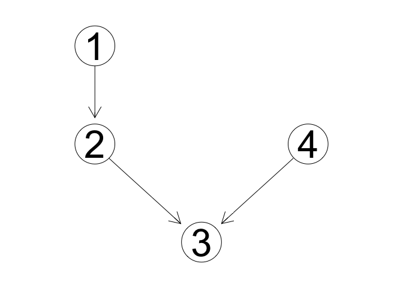
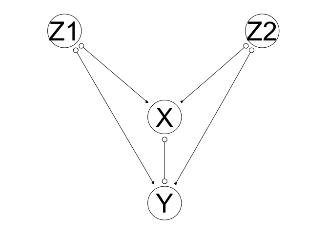
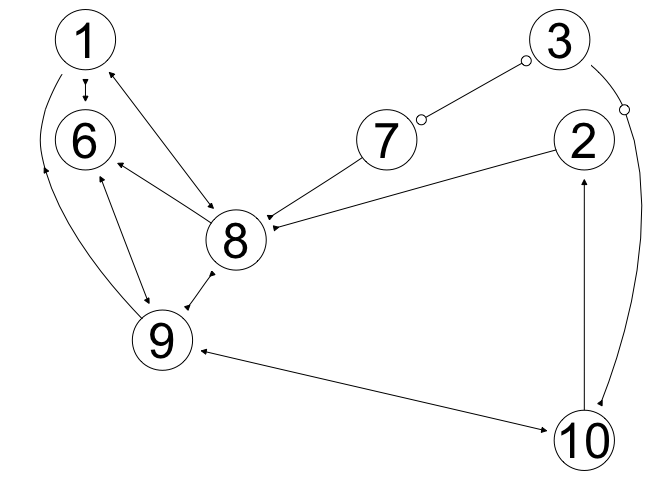

1017 demo
================
Yuki Joyama
2024-10-17

``` r
library(pcalg)
```

    ## Warning: package 'pcalg' was built under R version 4.3.3

``` r
## true DAG
## X1 -> X2 <- L -> X3 <- X4

set.seed(123)
n <- 10000
X1 <- rnorm(n, 0 , .5)
X4 <- rnorm(n, 0, 1.4)
L <- rnorm(n, 0, 0.7)
X2 <- rnorm(n, -1 + 0.8*X1 + 0.8*L, 1)
X3 <- rnorm(n, -1 + 2.2*X4 + 1.8*L, 1)

data <- cbind(X1,X2,X3,X4) ## L is not observed in data

indepTest <- gaussCItest ## specify the independence test
suffStat <- list(C = cor(data), n = n) ## using the correlation matrix

fci.est <- fci(suffStat, indepTest, alpha = 0.05, p = 4, verbose=TRUE) ## estimate a PAG
```

    ## Compute Skeleton
    ## ================
    ## Order=0; remaining edges:12
    ## x= 1  y= 2  S=  : pval = 9.704665e-252 
    ## x= 1  y= 3  S=  : pval = 0.1542436 
    ## x= 1  y= 4  S=  : pval = 0.547115 
    ## x= 2  y= 1  S=  : pval = 9.704665e-252 
    ## x= 2  y= 3  S=  : pval = 1.181796e-62 
    ## x= 2  y= 4  S=  : pval = 0.6052871 
    ## x= 3  y= 2  S=  : pval = 1.181796e-62 
    ## x= 3  y= 4  S=  : pval = 0 
    ## x= 4  y= 3  S=  : pval = 0 
    ## Order=1; remaining edges:6
    ## x= 2  y= 1  S= 3 : pval = 2.250161e-255 
    ## x= 2  y= 3  S= 1 : pval = 3.242602e-66 
    ## x= 3  y= 2  S= 4 : pval = 0 
    ## x= 3  y= 4  S= 2 : pval = 0 
    ## 
    ## Compute PDSEP
    ## =============
    ## 
    ## Compute collider:
    ## 
    ##  1 *-> 2 <-* 3 
    ## 
    ##  3 *-> 2 <-* 1 
    ## 
    ##  2 *-> 3 <-* 4 
    ## 
    ##  4 *-> 3 <-* 2 
    ## 
    ## Possible D-Sep of 1 is: 2 3 4 
    ## 
    ## y =   2
    ## .........
    ## ord =  1 
    ## ord =  2 
    ## 
    ## Possible D-Sep of 2 is: 1 3 4 
    ## 
    ## y =   1
    ## .........
    ## ord =  1 
    ## ord =  2 
    ## 
    ## y =   3
    ## .........
    ## ord =  1 
    ## ord =  2 
    ## 
    ## Possible D-Sep of 3 is: 1 2 4 
    ## 
    ## y =   2
    ## .........
    ## ord =  1 
    ## ord =  2 
    ## 
    ## y =   4
    ## .........
    ## ord =  1 
    ## ord =  2 
    ## 
    ## Possible D-Sep of 4 is: 1 2 3 
    ## 
    ## y =   3
    ## .........
    ## ord =  1 
    ## ord =  2 
    ## 
    ## Direct edges:
    ## =============
    ## Using rules: 1 2 3 4 5 6 7 8 9 10 
    ## Compute collider:
    ## 
    ##  1 *-> 2 <-* 3 
    ## Sxz= and Szx=  
    ## 
    ##  3 *-> 2 <-* 1 
    ## Sxz=  and Szx= 
    ## 
    ##  2 *-> 3 <-* 4 
    ## Sxz= and Szx=  
    ## 
    ##  4 *-> 3 <-* 2 
    ## Sxz=  and Szx=

``` r
plot(fci.est)
```

    ## Loading required namespace: Rgraphviz

<!-- -->

``` r
as(fci.est, "matrix")
```

    ##   1 2 3 4
    ## 1 0 2 0 0
    ## 2 1 0 2 0
    ## 3 0 2 0 1
    ## 4 0 0 2 0
    ## attr(,"type")
    ## [1] "amat.pag"

``` r
pc.est <- pc(suffStat, indepTest, alpha = 0.05, p = 4, verbose=TRUE) ## estimate at CPDAG
```

    ## Order=0; remaining edges:12
    ## x= 1  y= 2  S=  : pval = 9.704665e-252 
    ## x= 1  y= 3  S=  : pval = 0.1542436 
    ## x= 1  y= 4  S=  : pval = 0.547115 
    ## x= 2  y= 1  S=  : pval = 9.704665e-252 
    ## x= 2  y= 3  S=  : pval = 1.181796e-62 
    ## x= 2  y= 4  S=  : pval = 0.6052871 
    ## x= 3  y= 2  S=  : pval = 1.181796e-62 
    ## x= 3  y= 4  S=  : pval = 0 
    ## x= 4  y= 3  S=  : pval = 0 
    ## Order=1; remaining edges:6
    ## x= 2  y= 1  S= 3 : pval = 2.250161e-255 
    ## x= 2  y= 3  S= 1 : pval = 3.242602e-66 
    ## x= 3  y= 2  S= 4 : pval = 0 
    ## x= 3  y= 4  S= 2 : pval = 0

``` r
plot(pc.est, main = "") 
```

<!-- -->

``` r
as(pc.est, "matrix")
```

    ##   1 2 3 4
    ## 1 0 0 0 0
    ## 2 1 0 0 0
    ## 3 0 1 0 1
    ## 4 0 0 0 0
    ## attr(,"type")
    ## [1] "amat.cpdag"

``` r
score <- new("GaussL0penObsScore", data) ## define a score function

ges.fit <- ges(score, verbose=TRUE) ## estimate at CPDAG with GES
```

    ## Casting graph...
    ## Casting options...
    ## Performing GIES...
    ## == starting forward phase (not adaptive)...
    ##   inserting edge (3, 2) with C = {}, S = 7694.22
    ## == starting forward phase (not adaptive)...
    ##   inserting edge (1, 2) with C = {3}, S = 720.438
    ## == starting forward phase (not adaptive)...
    ##   inserting edge (0, 1) with C = {}, S = 559.124
    ## == starting forward phase (not adaptive)...
    ##   inserting edge (0, 2) with C = {}, S = 61.4939
    ## == starting forward phase (not adaptive)...
    ## == starting backward phase...
    ## == starting turning phase...
    ## == starting forward phase (not adaptive)...
    ## == starting backward phase...
    ## == starting turning phase...

``` r
plot(ges.fit$essgraph)
```

<!-- -->

``` r
## WARNING: the default plotting method for CPDAGs in package 'pcalg' will display undirected (--) edges
## as if they are bidirected (<->). This is just a somewhat annoying feature of the plot function, they
## are not really bidirected edges, they are undirected. CPDAGs only contain directed and undirected edges!


####

## True DAG: Z1 -> X <-- Z2 ; X --> Y <-- L ; possibly L -?-> X

set.seed(123)
n <- 10000
Z1 <- rnorm(n, 0, .5)
Z2 <- rnorm(n, 0 , 1.5)
L <- rnorm(n, 0, 1)
X <- rnorm(n, 0.8*Z1 + 0.8*Z2 + 1.5*L, 1) ## try coefficient for L with a zero, see result change
Y <- rnorm(n, 1.6*X + 0.6*L, 1) 

data <- cbind(Z1,Z2,X,Y) ## L is not observed in data

indepTest <- gaussCItest ## specify the independence test
suffStat <- list(C = cor(data), n = n) ## using the correlation matrix

fci.est <- fci(suffStat, indepTest, alpha = 0.05, labels = c("Z1","Z2","X","Y"), verbose=TRUE) ## estimate a PAG
```

    ## Compute Skeleton
    ## ================
    ## Order=0; remaining edges:12
    ## x= 1  y= 2  S=  : pval = 0.547115 
    ## x= 1  y= 3  S=  : pval = 1.351429e-83 
    ## x= 1  y= 4  S=  : pval = 3.231566e-65 
    ## x= 2  y= 3  S=  : pval = 0 
    ## x= 2  y= 4  S=  : pval = 0 
    ## x= 3  y= 1  S=  : pval = 1.351429e-83 
    ## x= 3  y= 2  S=  : pval = 0 
    ## x= 3  y= 4  S=  : pval = 0 
    ## x= 4  y= 1  S=  : pval = 3.231566e-65 
    ## x= 4  y= 2  S=  : pval = 0 
    ## x= 4  y= 3  S=  : pval = 0 
    ## Order=1; remaining edges:10
    ## x= 1  y= 3  S= 4 : pval = 1.604122e-27 
    ## x= 1  y= 4  S= 3 : pval = 4.280841e-09 
    ## x= 2  y= 3  S= 4 : pval = 0 
    ## x= 2  y= 4  S= 3 : pval = 8.536593e-141 
    ## x= 3  y= 1  S= 2 : pval = 3.02513e-115 
    ## x= 3  y= 1  S= 4 : pval = 1.604122e-27 
    ## x= 3  y= 2  S= 1 : pval = 0 
    ## x= 3  y= 2  S= 4 : pval = 0 
    ## x= 3  y= 4  S= 1 : pval = 0 
    ## x= 3  y= 4  S= 2 : pval = 0 
    ## x= 4  y= 1  S= 2 : pval = 8.109867e-81 
    ## x= 4  y= 1  S= 3 : pval = 4.280841e-09 
    ## x= 4  y= 2  S= 1 : pval = 0 
    ## x= 4  y= 2  S= 3 : pval = 8.536593e-141 
    ## x= 4  y= 3  S= 1 : pval = 0 
    ## x= 4  y= 3  S= 2 : pval = 0 
    ## Order=2; remaining edges:10
    ## x= 3  y= 1  S= 2 4 : pval = 2.059864e-54 
    ## x= 3  y= 2  S= 1 4 : pval = 0 
    ## x= 3  y= 4  S= 1 2 : pval = 0 
    ## x= 4  y= 1  S= 2 3 : pval = 3.729205e-20 
    ## x= 4  y= 2  S= 1 3 : pval = 6.889752e-152 
    ## x= 4  y= 3  S= 1 2 : pval = 0 
    ## 
    ## Compute PDSEP
    ## =============
    ## 
    ## Compute collider:
    ## 
    ##  1 *-> 3 <-* 2 
    ## 
    ##  2 *-> 3 <-* 1 
    ## 
    ##  1 *-> 4 <-* 2 
    ## 
    ##  2 *-> 4 <-* 1 
    ## 
    ## Possible D-Sep of 1 is: 2 3 4 
    ## 
    ## y =   3
    ## .........
    ## ord =  1 
    ## ord =  2 
    ## 
    ## y =   4
    ## .........
    ## ord =  1 
    ## ord =  2 
    ## 
    ## Possible D-Sep of 2 is: 1 3 4 
    ## 
    ## y =   3
    ## .........
    ## ord =  1 
    ## ord =  2 
    ## 
    ## y =   4
    ## .........
    ## ord =  1 
    ## ord =  2 
    ## 
    ## Possible D-Sep of 3 is: 1 2 4 
    ## 
    ## y =   1
    ## .........
    ## 
    ## y =   2
    ## .........
    ## 
    ## y =   4
    ## .........
    ## 
    ## Possible D-Sep of 4 is: 1 2 3 
    ## 
    ## y =   1
    ## .........
    ## 
    ## y =   2
    ## .........
    ## 
    ## y =   3
    ## .........
    ## 
    ## Direct edges:
    ## =============
    ## Using rules: 1 2 3 4 5 6 7 8 9 10 
    ## Compute collider:
    ## 
    ##  1 *-> 3 <-* 2 
    ## Sxz= and Szx=  
    ## 
    ##  2 *-> 3 <-* 1 
    ## Sxz=  and Szx= 
    ## 
    ##  1 *-> 4 <-* 2 
    ## Sxz= and Szx=  
    ## 
    ##  2 *-> 4 <-* 1 
    ## Sxz=  and Szx=

``` r
plot(fci.est)
```

<!-- -->

``` r
## to remove edge between Y and L, change 0.6 to 0
set.seed(123)
n <- 10000
Z1 <- rnorm(n, 0, .5)
Z2 <- rnorm(n, 0 , 1.5)
L <- rnorm(n, 0, 1)
X <- rnorm(n, 0.8*Z1 + 0.8*Z2 + 1.5*L, 1) ## try coefficient for L with a zero, see result change
Y <- rnorm(n, 1.6*X + 0*L, 1) 

data <- cbind(Z1,Z2,X,Y) ## L is not observed in data

indepTest <- gaussCItest ## specify the independence test
suffStat <- list(C = cor(data), n = n) ## using the correlation matrix

fci.est <- fci(suffStat, indepTest, alpha = 0.05, labels = c("Z1","Z2","X","Y"), verbose=TRUE) ## estimate a PAG
```

    ## Compute Skeleton
    ## ================
    ## Order=0; remaining edges:12
    ## x= 1  y= 2  S=  : pval = 0.547115 
    ## x= 1  y= 3  S=  : pval = 1.351429e-83 
    ## x= 1  y= 4  S=  : pval = 4.494662e-78 
    ## x= 2  y= 3  S=  : pval = 0 
    ## x= 2  y= 4  S=  : pval = 0 
    ## x= 3  y= 1  S=  : pval = 1.351429e-83 
    ## x= 3  y= 2  S=  : pval = 0 
    ## x= 3  y= 4  S=  : pval = 0 
    ## x= 4  y= 1  S=  : pval = 4.494662e-78 
    ## x= 4  y= 2  S=  : pval = 0 
    ## x= 4  y= 3  S=  : pval = 0 
    ## Order=1; remaining edges:10
    ## x= 1  y= 3  S= 4 : pval = 5.236219e-07 
    ## x= 1  y= 4  S= 3 : pval = 0.741041 
    ## x= 2  y= 3  S= 4 : pval = 6.710693e-72 
    ## x= 2  y= 4  S= 3 : pval = 0.8164295 
    ## x= 3  y= 1  S= 2 : pval = 3.02513e-115 
    ## x= 3  y= 1  S= 4 : pval = 5.236219e-07 
    ## x= 3  y= 2  S= 1 : pval = 0 
    ## x= 3  y= 2  S= 4 : pval = 6.710693e-72 
    ## x= 3  y= 4  S= 1 : pval = 0 
    ## x= 3  y= 4  S= 2 : pval = 0 
    ## x= 4  y= 3  S= 1 : pval = 0 
    ## x= 4  y= 3  S= 2 : pval = 0 
    ## Order=2; remaining edges:6
    ## x= 3  y= 1  S= 2 4 : pval = 1.213041e-12 
    ## x= 3  y= 2  S= 1 4 : pval = 1.865992e-77 
    ## x= 3  y= 4  S= 1 2 : pval = 0 
    ## 
    ## Compute PDSEP
    ## =============
    ## 
    ## Compute collider:
    ## 
    ##  1 *-> 3 <-* 2 
    ## 
    ##  2 *-> 3 <-* 1 
    ## 
    ## Possible D-Sep of 1 is: 2 3 
    ## 
    ## y =   3
    ## .........
    ## ord =  1 
    ## 
    ## Possible D-Sep of 2 is: 1 3 
    ## 
    ## y =   3
    ## .........
    ## ord =  1 
    ## 
    ## Possible D-Sep of 3 is: 1 2 4 
    ## 
    ## y =   1
    ## .........
    ## 
    ## y =   2
    ## .........
    ## 
    ## y =   4
    ## .........
    ## 
    ## Possible D-Sep of 4 is: 3 
    ## 
    ## y =   3
    ## .........
    ## 
    ## Direct edges:
    ## =============
    ## Using rules: 1 2 3 4 5 6 7 8 9 10 
    ## Compute collider:
    ## 
    ##  1 *-> 3 <-* 2 
    ## Sxz= and Szx=  
    ## 
    ##  2 *-> 3 <-* 1 
    ## Sxz=  and Szx= 
    ## 
    ## Rule 1 
    ## Orient: 1 *-> 3 o-* 4 as: 3 -> 4

``` r
plot(fci.est)
```

<!-- -->

``` r
## try a random DAG

p <- 10
n <- 10000
myDAG <- pcalg::randomDAG(n = p, prob = 0.4)
plot(myDAG)
```

<!-- -->

``` r
data <- rmvDAG(n, myDAG, errDist = "normal")
data <- data[,-c(4,5)] ## "hide" two of the variables

indepTest <- gaussCItest ## specify the independence test
suffStat <- list(C = cor(data), n = n) ## using the correlation matrix

fci.est <- fci(suffStat, indepTest, alpha = 0.01, labels = c("1","2","3","6","7","8","9","10"), verbose=TRUE) ## estimate a PAG
```

    ## Compute Skeleton
    ## ================
    ## Order=0; remaining edges:56
    ## x= 1  y= 2  S=  : pval = 2.002489e-170 
    ## x= 1  y= 3  S=  : pval = 2.227008e-85 
    ## x= 1  y= 4  S=  : pval = 0 
    ## x= 1  y= 5  S=  : pval = 2.303158e-282 
    ## x= 1  y= 6  S=  : pval = 0 
    ## x= 1  y= 7  S=  : pval = 0 
    ## x= 1  y= 8  S=  : pval = 1.932269e-289 
    ## x= 2  y= 1  S=  : pval = 2.002489e-170 
    ## x= 2  y= 3  S=  : pval = 0 
    ## x= 2  y= 4  S=  : pval = 0 
    ## x= 2  y= 5  S=  : pval = 0 
    ## x= 2  y= 6  S=  : pval = 0 
    ## x= 2  y= 7  S=  : pval = 0 
    ## x= 2  y= 8  S=  : pval = 0 
    ## x= 3  y= 1  S=  : pval = 2.227008e-85 
    ## x= 3  y= 2  S=  : pval = 0 
    ## x= 3  y= 4  S=  : pval = 0 
    ## x= 3  y= 5  S=  : pval = 0 
    ## x= 3  y= 6  S=  : pval = 0 
    ## x= 3  y= 7  S=  : pval = 0 
    ## x= 3  y= 8  S=  : pval = 0 
    ## x= 4  y= 1  S=  : pval = 0 
    ## x= 4  y= 2  S=  : pval = 0 
    ## x= 4  y= 3  S=  : pval = 0 
    ## x= 4  y= 5  S=  : pval = 0 
    ## x= 4  y= 6  S=  : pval = 0 
    ## x= 4  y= 7  S=  : pval = 0 
    ## x= 4  y= 8  S=  : pval = 0 
    ## x= 5  y= 1  S=  : pval = 2.303158e-282 
    ## x= 5  y= 2  S=  : pval = 0 
    ## x= 5  y= 3  S=  : pval = 0 
    ## x= 5  y= 4  S=  : pval = 0 
    ## x= 5  y= 6  S=  : pval = 0 
    ## x= 5  y= 7  S=  : pval = 0 
    ## x= 5  y= 8  S=  : pval = 0 
    ## x= 6  y= 1  S=  : pval = 0 
    ## x= 6  y= 2  S=  : pval = 0 
    ## x= 6  y= 3  S=  : pval = 0 
    ## x= 6  y= 4  S=  : pval = 0 
    ## x= 6  y= 5  S=  : pval = 0 
    ## x= 6  y= 7  S=  : pval = 0 
    ## x= 6  y= 8  S=  : pval = 0 
    ## x= 7  y= 1  S=  : pval = 0 
    ## x= 7  y= 2  S=  : pval = 0 
    ## x= 7  y= 3  S=  : pval = 0 
    ## x= 7  y= 4  S=  : pval = 0 
    ## x= 7  y= 5  S=  : pval = 0 
    ## x= 7  y= 6  S=  : pval = 0 
    ## x= 7  y= 8  S=  : pval = 0 
    ## x= 8  y= 1  S=  : pval = 1.932269e-289 
    ## x= 8  y= 2  S=  : pval = 0 
    ## x= 8  y= 3  S=  : pval = 0 
    ## x= 8  y= 4  S=  : pval = 0 
    ## x= 8  y= 5  S=  : pval = 0 
    ## x= 8  y= 6  S=  : pval = 0 
    ## x= 8  y= 7  S=  : pval = 0 
    ## Order=1; remaining edges:56
    ## x= 1  y= 2  S= 3 : pval = 4.694012e-86 
    ## x= 1  y= 2  S= 4 : pval = 0.0001178844 
    ## x= 1  y= 2  S= 5 : pval = 4.398234e-26 
    ## x= 1  y= 2  S= 6 : pval = 0.07514757 
    ## x= 1  y= 3  S= 2 : pval = 0.4672742 
    ## x= 1  y= 4  S= 2 : pval = 0 
    ## x= 1  y= 4  S= 3 : pval = 0 
    ## x= 1  y= 4  S= 5 : pval = 0 
    ## x= 1  y= 4  S= 6 : pval = 0 
    ## x= 1  y= 4  S= 7 : pval = 1.848543e-50 
    ## x= 1  y= 4  S= 8 : pval = 0 
    ## x= 1  y= 5  S= 2 : pval = 7.000483e-136 
    ## x= 1  y= 5  S= 3 : pval = 2.382952e-197 
    ## x= 1  y= 5  S= 4 : pval = 0.5617774 
    ## x= 1  y= 6  S= 2 : pval = 7.002404e-203 
    ## x= 1  y= 6  S= 3 : pval = 3.696415e-294 
    ## x= 1  y= 6  S= 4 : pval = 2.21962e-24 
    ## x= 1  y= 6  S= 5 : pval = 1.52802e-96 
    ## x= 1  y= 6  S= 7 : pval = 2.080975e-51 
    ## x= 1  y= 6  S= 8 : pval = 3.871702e-127 
    ## x= 1  y= 7  S= 2 : pval = 0 
    ## x= 1  y= 7  S= 3 : pval = 0 
    ## x= 1  y= 7  S= 4 : pval = 1.363535e-150 
    ## x= 1  y= 7  S= 5 : pval = 0 
    ## x= 1  y= 7  S= 6 : pval = 0 
    ## x= 1  y= 7  S= 8 : pval = 0 
    ## x= 1  y= 8  S= 2 : pval = 1.124671e-125 
    ## x= 1  y= 8  S= 3 : pval = 1.324839e-241 
    ## x= 1  y= 8  S= 4 : pval = 1.672416e-18 
    ## x= 1  y= 8  S= 5 : pval = 5.581363e-88 
    ## x= 1  y= 8  S= 6 : pval = 6.87468e-44 
    ## x= 1  y= 8  S= 7 : pval = 0.002726773 
    ## x= 2  y= 3  S= 1 : pval = 0 
    ## x= 2  y= 3  S= 4 : pval = 0 
    ## x= 2  y= 3  S= 5 : pval = 0 
    ## x= 2  y= 3  S= 6 : pval = 0 
    ## x= 2  y= 3  S= 7 : pval = 0 
    ## x= 2  y= 3  S= 8 : pval = 4.512548e-18 
    ## x= 2  y= 4  S= 1 : pval = 0 
    ## x= 2  y= 4  S= 3 : pval = 0 
    ## x= 2  y= 4  S= 5 : pval = 4.994465e-218 
    ## x= 2  y= 4  S= 6 : pval = 0.008980532 
    ## x= 2  y= 4  S= 7 : pval = 1.47359e-05 
    ## x= 2  y= 4  S= 8 : pval = 8.929238e-112 
    ## x= 2  y= 5  S= 1 : pval = 0 
    ## x= 2  y= 5  S= 3 : pval = 3.370841e-116 
    ## x= 2  y= 5  S= 4 : pval = 3.354958e-225 
    ## x= 2  y= 5  S= 6 : pval = 0.009734696 
    ## x= 2  y= 5  S= 7 : pval = 2.733133e-194 
    ## x= 2  y= 5  S= 8 : pval = 3.008991e-40 
    ## x= 2  y= 6  S= 1 : pval = 0 
    ## x= 2  y= 6  S= 3 : pval = 0 
    ## x= 2  y= 6  S= 4 : pval = 0 
    ## x= 2  y= 6  S= 5 : pval = 0 
    ## x= 2  y= 6  S= 7 : pval = 1.644356e-255 
    ## x= 2  y= 6  S= 8 : pval = 1.888788e-185 
    ## x= 2  y= 7  S= 1 : pval = 0 
    ## x= 2  y= 7  S= 3 : pval = 0 
    ## x= 2  y= 7  S= 4 : pval = 0 
    ## x= 2  y= 7  S= 5 : pval = 0 
    ## x= 2  y= 7  S= 6 : pval = 2.245607e-110 
    ## x= 2  y= 7  S= 8 : pval = 2.992e-98 
    ## x= 2  y= 8  S= 1 : pval = 0 
    ## x= 2  y= 8  S= 3 : pval = 0 
    ## x= 2  y= 8  S= 4 : pval = 0 
    ## x= 2  y= 8  S= 5 : pval = 0 
    ## x= 2  y= 8  S= 6 : pval = 0 
    ## x= 2  y= 8  S= 7 : pval = 0 
    ## x= 3  y= 2  S= 1 : pval = 0 
    ## x= 3  y= 2  S= 4 : pval = 0 
    ## x= 3  y= 2  S= 5 : pval = 0 
    ## x= 3  y= 2  S= 6 : pval = 0 
    ## x= 3  y= 2  S= 7 : pval = 0 
    ## x= 3  y= 2  S= 8 : pval = 4.512548e-18 
    ## x= 3  y= 4  S= 1 : pval = 1.790205e-271 
    ## x= 3  y= 4  S= 2 : pval = 0.4232502 
    ## x= 3  y= 5  S= 1 : pval = 0 
    ## x= 3  y= 5  S= 2 : pval = 0 
    ## x= 3  y= 5  S= 4 : pval = 0 
    ## x= 3  y= 5  S= 6 : pval = 6.477703e-165 
    ## x= 3  y= 5  S= 7 : pval = 0 
    ## x= 3  y= 5  S= 8 : pval = 2.256507e-219 
    ## x= 3  y= 6  S= 1 : pval = 0 
    ## x= 3  y= 6  S= 2 : pval = 2.36984e-129 
    ## x= 3  y= 6  S= 4 : pval = 0 
    ## x= 3  y= 6  S= 5 : pval = 3.435061e-99 
    ## x= 3  y= 6  S= 7 : pval = 0 
    ## x= 3  y= 6  S= 8 : pval = 1.902065e-80 
    ## x= 3  y= 7  S= 1 : pval = 0 
    ## x= 3  y= 7  S= 2 : pval = 0.2585377 
    ## x= 3  y= 8  S= 1 : pval = 0 
    ## x= 3  y= 8  S= 2 : pval = 0 
    ## x= 3  y= 8  S= 4 : pval = 0 
    ## x= 3  y= 8  S= 5 : pval = 0 
    ## x= 3  y= 8  S= 6 : pval = 0 
    ## x= 3  y= 8  S= 7 : pval = 0 
    ## x= 4  y= 1  S= 2 : pval = 0 
    ## x= 4  y= 1  S= 3 : pval = 0 
    ## x= 4  y= 1  S= 5 : pval = 0 
    ## x= 4  y= 1  S= 6 : pval = 0 
    ## x= 4  y= 1  S= 7 : pval = 1.848543e-50 
    ## x= 4  y= 1  S= 8 : pval = 0 
    ## x= 4  y= 2  S= 1 : pval = 0 
    ## x= 4  y= 2  S= 3 : pval = 0 
    ## x= 4  y= 2  S= 5 : pval = 4.994465e-218 
    ## x= 4  y= 2  S= 6 : pval = 0.008980532 
    ## x= 4  y= 2  S= 7 : pval = 1.47359e-05 
    ## x= 4  y= 2  S= 8 : pval = 8.929238e-112 
    ## x= 4  y= 5  S= 1 : pval = 0 
    ## x= 4  y= 5  S= 2 : pval = 0 
    ## x= 4  y= 5  S= 3 : pval = 0 
    ## x= 4  y= 5  S= 6 : pval = 2.180168e-09 
    ## x= 4  y= 5  S= 7 : pval = 2.708383e-279 
    ## x= 4  y= 5  S= 8 : pval = 0 
    ## x= 4  y= 6  S= 1 : pval = 0 
    ## x= 4  y= 6  S= 2 : pval = 0 
    ## x= 4  y= 6  S= 3 : pval = 0 
    ## x= 4  y= 6  S= 5 : pval = 0 
    ## x= 4  y= 6  S= 7 : pval = 0 
    ## x= 4  y= 6  S= 8 : pval = 0 
    ## x= 4  y= 7  S= 1 : pval = 0 
    ## x= 4  y= 7  S= 2 : pval = 0 
    ## x= 4  y= 7  S= 3 : pval = 0 
    ## x= 4  y= 7  S= 5 : pval = 0 
    ## x= 4  y= 7  S= 6 : pval = 0 
    ## x= 4  y= 7  S= 8 : pval = 0 
    ## x= 4  y= 8  S= 1 : pval = 0 
    ## x= 4  y= 8  S= 2 : pval = 7.629465e-37 
    ## x= 4  y= 8  S= 3 : pval = 0 
    ## x= 4  y= 8  S= 5 : pval = 6.705313e-144 
    ## x= 4  y= 8  S= 6 : pval = 0.186465 
    ## x= 5  y= 2  S= 1 : pval = 0 
    ## x= 5  y= 2  S= 3 : pval = 3.370841e-116 
    ## x= 5  y= 2  S= 4 : pval = 3.354958e-225 
    ## x= 5  y= 2  S= 6 : pval = 0.009734696 
    ## x= 5  y= 2  S= 7 : pval = 2.733133e-194 
    ## x= 5  y= 2  S= 8 : pval = 3.008991e-40 
    ## x= 5  y= 3  S= 1 : pval = 0 
    ## x= 5  y= 3  S= 2 : pval = 0 
    ## x= 5  y= 3  S= 4 : pval = 0 
    ## x= 5  y= 3  S= 6 : pval = 6.477703e-165 
    ## x= 5  y= 3  S= 7 : pval = 0 
    ## x= 5  y= 3  S= 8 : pval = 2.256507e-219 
    ## x= 5  y= 4  S= 1 : pval = 0 
    ## x= 5  y= 4  S= 2 : pval = 0 
    ## x= 5  y= 4  S= 3 : pval = 0 
    ## x= 5  y= 4  S= 6 : pval = 2.180168e-09 
    ## x= 5  y= 4  S= 7 : pval = 2.708383e-279 
    ## x= 5  y= 4  S= 8 : pval = 0 
    ## x= 5  y= 6  S= 1 : pval = 0 
    ## x= 5  y= 6  S= 2 : pval = 0 
    ## x= 5  y= 6  S= 3 : pval = 0 
    ## x= 5  y= 6  S= 4 : pval = 0 
    ## x= 5  y= 6  S= 7 : pval = 0 
    ## x= 5  y= 6  S= 8 : pval = 0 
    ## x= 5  y= 7  S= 1 : pval = 0 
    ## x= 5  y= 7  S= 2 : pval = 5.487479e-308 
    ## x= 5  y= 7  S= 3 : pval = 0 
    ## x= 5  y= 7  S= 4 : pval = 8.474846e-28 
    ## x= 5  y= 7  S= 6 : pval = 2.370948e-120 
    ## x= 5  y= 7  S= 8 : pval = 3.568152e-268 
    ## x= 5  y= 8  S= 1 : pval = 0 
    ## x= 5  y= 8  S= 2 : pval = 1.746619e-131 
    ## x= 5  y= 8  S= 3 : pval = 1.22789e-100 
    ## x= 5  y= 8  S= 4 : pval = 0 
    ## x= 5  y= 8  S= 6 : pval = 1.444208e-33 
    ## x= 5  y= 8  S= 7 : pval = 9.143125e-248 
    ## x= 6  y= 1  S= 2 : pval = 7.002404e-203 
    ## x= 6  y= 1  S= 3 : pval = 3.696415e-294 
    ## x= 6  y= 1  S= 4 : pval = 2.21962e-24 
    ## x= 6  y= 1  S= 5 : pval = 1.52802e-96 
    ## x= 6  y= 1  S= 7 : pval = 2.080975e-51 
    ## x= 6  y= 1  S= 8 : pval = 3.871702e-127 
    ## x= 6  y= 2  S= 1 : pval = 0 
    ## x= 6  y= 2  S= 3 : pval = 0 
    ## x= 6  y= 2  S= 4 : pval = 0 
    ## x= 6  y= 2  S= 5 : pval = 0 
    ## x= 6  y= 2  S= 7 : pval = 1.644356e-255 
    ## x= 6  y= 2  S= 8 : pval = 1.888788e-185 
    ## x= 6  y= 3  S= 1 : pval = 0 
    ## x= 6  y= 3  S= 2 : pval = 2.36984e-129 
    ## x= 6  y= 3  S= 4 : pval = 0 
    ## x= 6  y= 3  S= 5 : pval = 3.435061e-99 
    ## x= 6  y= 3  S= 7 : pval = 0 
    ## x= 6  y= 3  S= 8 : pval = 1.902065e-80 
    ## x= 6  y= 4  S= 1 : pval = 0 
    ## x= 6  y= 4  S= 2 : pval = 0 
    ## x= 6  y= 4  S= 3 : pval = 0 
    ## x= 6  y= 4  S= 5 : pval = 0 
    ## x= 6  y= 4  S= 7 : pval = 0 
    ## x= 6  y= 4  S= 8 : pval = 0 
    ## x= 6  y= 5  S= 1 : pval = 0 
    ## x= 6  y= 5  S= 2 : pval = 0 
    ## x= 6  y= 5  S= 3 : pval = 0 
    ## x= 6  y= 5  S= 4 : pval = 0 
    ## x= 6  y= 5  S= 7 : pval = 0 
    ## x= 6  y= 5  S= 8 : pval = 0 
    ## x= 6  y= 7  S= 1 : pval = 0 
    ## x= 6  y= 7  S= 2 : pval = 0 
    ## x= 6  y= 7  S= 3 : pval = 0 
    ## x= 6  y= 7  S= 4 : pval = 0 
    ## x= 6  y= 7  S= 5 : pval = 0 
    ## x= 6  y= 7  S= 8 : pval = 0 
    ## x= 6  y= 8  S= 1 : pval = 0 
    ## x= 6  y= 8  S= 2 : pval = 1.647872e-79 
    ## x= 6  y= 8  S= 3 : pval = 0 
    ## x= 6  y= 8  S= 4 : pval = 0 
    ## x= 6  y= 8  S= 5 : pval = 0 
    ## x= 6  y= 8  S= 7 : pval = 2.458009e-168 
    ## x= 7  y= 1  S= 2 : pval = 0 
    ## x= 7  y= 1  S= 3 : pval = 0 
    ## x= 7  y= 1  S= 4 : pval = 1.363535e-150 
    ## x= 7  y= 1  S= 5 : pval = 0 
    ## x= 7  y= 1  S= 6 : pval = 0 
    ## x= 7  y= 1  S= 8 : pval = 0 
    ## x= 7  y= 2  S= 1 : pval = 0 
    ## x= 7  y= 2  S= 3 : pval = 0 
    ## x= 7  y= 2  S= 4 : pval = 0 
    ## x= 7  y= 2  S= 5 : pval = 0 
    ## x= 7  y= 2  S= 6 : pval = 2.245607e-110 
    ## x= 7  y= 2  S= 8 : pval = 2.992e-98 
    ## x= 7  y= 4  S= 1 : pval = 0 
    ## x= 7  y= 4  S= 2 : pval = 0 
    ## x= 7  y= 4  S= 3 : pval = 0 
    ## x= 7  y= 4  S= 5 : pval = 0 
    ## x= 7  y= 4  S= 6 : pval = 0 
    ## x= 7  y= 4  S= 8 : pval = 0 
    ## x= 7  y= 5  S= 1 : pval = 0 
    ## x= 7  y= 5  S= 2 : pval = 5.487479e-308 
    ## x= 7  y= 5  S= 3 : pval = 0 
    ## x= 7  y= 5  S= 4 : pval = 8.474846e-28 
    ## x= 7  y= 5  S= 6 : pval = 2.370948e-120 
    ## x= 7  y= 5  S= 8 : pval = 3.568152e-268 
    ## x= 7  y= 6  S= 1 : pval = 0 
    ## x= 7  y= 6  S= 2 : pval = 0 
    ## x= 7  y= 6  S= 3 : pval = 0 
    ## x= 7  y= 6  S= 4 : pval = 0 
    ## x= 7  y= 6  S= 5 : pval = 0 
    ## x= 7  y= 6  S= 8 : pval = 0 
    ## x= 7  y= 8  S= 1 : pval = 0 
    ## x= 7  y= 8  S= 2 : pval = 5.109471e-138 
    ## x= 7  y= 8  S= 3 : pval = 0 
    ## x= 7  y= 8  S= 4 : pval = 0 
    ## x= 7  y= 8  S= 5 : pval = 0 
    ## x= 7  y= 8  S= 6 : pval = 5.257361e-170 
    ## x= 8  y= 1  S= 2 : pval = 1.124671e-125 
    ## x= 8  y= 1  S= 3 : pval = 1.324839e-241 
    ## x= 8  y= 1  S= 4 : pval = 1.672416e-18 
    ## x= 8  y= 1  S= 5 : pval = 5.581363e-88 
    ## x= 8  y= 1  S= 6 : pval = 6.87468e-44 
    ## x= 8  y= 1  S= 7 : pval = 0.002726773 
    ## x= 8  y= 2  S= 1 : pval = 0 
    ## x= 8  y= 2  S= 3 : pval = 0 
    ## x= 8  y= 2  S= 4 : pval = 0 
    ## x= 8  y= 2  S= 5 : pval = 0 
    ## x= 8  y= 2  S= 6 : pval = 0 
    ## x= 8  y= 2  S= 7 : pval = 0 
    ## x= 8  y= 3  S= 1 : pval = 0 
    ## x= 8  y= 3  S= 2 : pval = 0 
    ## x= 8  y= 3  S= 4 : pval = 0 
    ## x= 8  y= 3  S= 5 : pval = 0 
    ## x= 8  y= 3  S= 6 : pval = 0 
    ## x= 8  y= 3  S= 7 : pval = 0 
    ## x= 8  y= 5  S= 1 : pval = 0 
    ## x= 8  y= 5  S= 2 : pval = 1.746619e-131 
    ## x= 8  y= 5  S= 3 : pval = 1.22789e-100 
    ## x= 8  y= 5  S= 4 : pval = 0 
    ## x= 8  y= 5  S= 6 : pval = 1.444208e-33 
    ## x= 8  y= 5  S= 7 : pval = 9.143125e-248 
    ## x= 8  y= 6  S= 1 : pval = 0 
    ## x= 8  y= 6  S= 2 : pval = 1.647872e-79 
    ## x= 8  y= 6  S= 3 : pval = 0 
    ## x= 8  y= 6  S= 4 : pval = 0 
    ## x= 8  y= 6  S= 5 : pval = 0 
    ## x= 8  y= 6  S= 7 : pval = 2.458009e-168 
    ## x= 8  y= 7  S= 1 : pval = 0 
    ## x= 8  y= 7  S= 2 : pval = 5.109471e-138 
    ## x= 8  y= 7  S= 3 : pval = 0 
    ## x= 8  y= 7  S= 4 : pval = 0 
    ## x= 8  y= 7  S= 5 : pval = 0 
    ## x= 8  y= 7  S= 6 : pval = 5.257361e-170 
    ## Order=2; remaining edges:44
    ## x= 1  y= 4  S= 6 7 : pval = 8.841813e-125 
    ## x= 1  y= 4  S= 6 8 : pval = 0 
    ## x= 1  y= 4  S= 7 8 : pval = 5.336881e-50 
    ## x= 1  y= 6  S= 4 7 : pval = 9.770883e-126 
    ## x= 1  y= 6  S= 4 8 : pval = 5.460818e-55 
    ## x= 1  y= 6  S= 7 8 : pval = 1.079093e-49 
    ## x= 1  y= 7  S= 4 6 : pval = 1.301915e-253 
    ## x= 1  y= 7  S= 4 8 : pval = 5.097362e-135 
    ## x= 1  y= 7  S= 6 8 : pval = 0 
    ## x= 1  y= 8  S= 4 6 : pval = 4.004238e-49 
    ## x= 1  y= 8  S= 4 7 : pval = 0.008586008 
    ## x= 1  y= 8  S= 6 7 : pval = 0.273671 
    ## x= 2  y= 3  S= 4 5 : pval = 0 
    ## x= 2  y= 3  S= 4 6 : pval = 0 
    ## x= 2  y= 3  S= 4 7 : pval = 0 
    ## x= 2  y= 3  S= 4 8 : pval = 9.094282e-23 
    ## x= 2  y= 3  S= 5 6 : pval = 0 
    ## x= 2  y= 3  S= 5 7 : pval = 0 
    ## x= 2  y= 3  S= 5 8 : pval = 1.05748e-06 
    ## x= 2  y= 3  S= 6 7 : pval = 0 
    ## x= 2  y= 3  S= 6 8 : pval = 0.0003913546 
    ## x= 2  y= 3  S= 7 8 : pval = 4.525407e-29 
    ## x= 2  y= 4  S= 3 5 : pval = 0 
    ## x= 2  y= 4  S= 3 6 : pval = 5.093743e-48 
    ## x= 2  y= 4  S= 3 7 : pval = 0.0004161356 
    ## x= 2  y= 4  S= 3 8 : pval = 1.747848e-116 
    ## x= 2  y= 4  S= 5 6 : pval = 0.00555157 
    ## x= 2  y= 4  S= 5 7 : pval = 5.585125e-10 
    ## x= 2  y= 4  S= 5 8 : pval = 6.622168e-75 
    ## x= 2  y= 4  S= 6 7 : pval = 4.435678e-27 
    ## x= 2  y= 4  S= 6 8 : pval = 0.01359421 
    ## x= 2  y= 5  S= 3 4 : pval = 0.4189326 
    ## x= 2  y= 6  S= 3 4 : pval = 1.398966e-79 
    ## x= 2  y= 6  S= 3 5 : pval = 0 
    ## x= 2  y= 6  S= 3 7 : pval = 2.330998e-23 
    ## x= 2  y= 6  S= 3 8 : pval = 1.693981e-171 
    ## x= 2  y= 6  S= 4 5 : pval = 6.22988e-267 
    ## x= 2  y= 6  S= 4 7 : pval = 1.900537e-277 
    ## x= 2  y= 6  S= 4 8 : pval = 8.97393e-76 
    ## x= 2  y= 6  S= 5 7 : pval = 1.155086e-75 
    ## x= 2  y= 6  S= 5 8 : pval = 8.845524e-169 
    ## x= 2  y= 6  S= 7 8 : pval = 4.407e-89 
    ## x= 2  y= 7  S= 3 4 : pval = 3.907899e-211 
    ## x= 2  y= 7  S= 3 5 : pval = 0 
    ## x= 2  y= 7  S= 3 6 : pval = 2.238679e-198 
    ## x= 2  y= 7  S= 3 8 : pval = 2.741393e-109 
    ## x= 2  y= 7  S= 4 5 : pval = 0 
    ## x= 2  y= 7  S= 4 6 : pval = 1.565732e-134 
    ## x= 2  y= 7  S= 4 8 : pval = 1.029933e-09 
    ## x= 2  y= 7  S= 5 6 : pval = 3.585954e-123 
    ## x= 2  y= 7  S= 5 8 : pval = 1.397245e-69 
    ## x= 2  y= 7  S= 6 8 : pval = 0.02149166 
    ## x= 2  y= 8  S= 3 4 : pval = 0 
    ## x= 2  y= 8  S= 3 5 : pval = 0 
    ## x= 2  y= 8  S= 3 6 : pval = 0 
    ## x= 2  y= 8  S= 3 7 : pval = 0 
    ## x= 2  y= 8  S= 4 5 : pval = 0 
    ## x= 2  y= 8  S= 4 6 : pval = 0 
    ## x= 2  y= 8  S= 4 7 : pval = 0 
    ## x= 2  y= 8  S= 5 6 : pval = 0 
    ## x= 2  y= 8  S= 5 7 : pval = 0 
    ## x= 2  y= 8  S= 6 7 : pval = 0 
    ## x= 3  y= 2  S= 5 6 : pval = 0 
    ## x= 3  y= 2  S= 5 8 : pval = 1.05748e-06 
    ## x= 3  y= 2  S= 6 8 : pval = 0.0003913546 
    ## x= 3  y= 5  S= 2 6 : pval = 5.837035e-202 
    ## x= 3  y= 5  S= 2 8 : pval = 7.191656e-208 
    ## x= 3  y= 5  S= 6 8 : pval = 2.097511e-143 
    ## x= 3  y= 6  S= 2 5 : pval = 1.867575e-05 
    ## x= 3  y= 6  S= 2 8 : pval = 1.070428e-66 
    ## x= 3  y= 6  S= 5 8 : pval = 1.627299e-05 
    ## x= 3  y= 8  S= 2 5 : pval = 0 
    ## x= 3  y= 8  S= 2 6 : pval = 0 
    ## x= 3  y= 8  S= 5 6 : pval = 0 
    ## x= 4  y= 1  S= 2 5 : pval = 0 
    ## x= 4  y= 1  S= 2 6 : pval = 0 
    ## x= 4  y= 1  S= 2 7 : pval = 6.47344e-56 
    ## x= 4  y= 1  S= 5 6 : pval = 0 
    ## x= 4  y= 1  S= 5 7 : pval = 2.074816e-52 
    ## x= 4  y= 1  S= 6 7 : pval = 8.841813e-125 
    ## x= 4  y= 5  S= 1 2 : pval = 0 
    ## x= 4  y= 5  S= 1 6 : pval = 7.082128e-19 
    ## x= 4  y= 5  S= 1 7 : pval = 2.789447e-281 
    ## x= 4  y= 5  S= 2 6 : pval = 1.401129e-09 
    ## x= 4  y= 5  S= 2 7 : pval = 1.008029e-283 
    ## x= 4  y= 5  S= 6 7 : pval = 2.553574e-13 
    ## x= 4  y= 6  S= 1 2 : pval = 0 
    ## x= 4  y= 6  S= 1 5 : pval = 0 
    ## x= 4  y= 6  S= 1 7 : pval = 0 
    ## x= 4  y= 6  S= 2 5 : pval = 0 
    ## x= 4  y= 6  S= 2 7 : pval = 0 
    ## x= 4  y= 6  S= 5 7 : pval = 2.265352e-149 
    ## x= 4  y= 7  S= 1 2 : pval = 0 
    ## x= 4  y= 7  S= 1 5 : pval = 0 
    ## x= 4  y= 7  S= 1 6 : pval = 0 
    ## x= 4  y= 7  S= 2 5 : pval = 0 
    ## x= 4  y= 7  S= 2 6 : pval = 0 
    ## x= 4  y= 7  S= 5 6 : pval = 0 
    ## x= 5  y= 3  S= 2 4 : pval = 0 
    ## x= 5  y= 3  S= 2 6 : pval = 5.837035e-202 
    ## x= 5  y= 3  S= 2 7 : pval = 0 
    ## x= 5  y= 3  S= 2 8 : pval = 7.191656e-208 
    ## x= 5  y= 3  S= 4 6 : pval = 4.056436e-157 
    ## x= 5  y= 3  S= 4 7 : pval = 0 
    ## x= 5  y= 3  S= 4 8 : pval = 0 
    ## x= 5  y= 3  S= 6 7 : pval = 5.222176e-156 
    ## x= 5  y= 3  S= 6 8 : pval = 2.097511e-143 
    ## x= 5  y= 3  S= 7 8 : pval = 0 
    ## x= 5  y= 4  S= 2 3 : pval = 0 
    ## x= 5  y= 4  S= 2 6 : pval = 1.401129e-09 
    ## x= 5  y= 4  S= 2 7 : pval = 1.008029e-283 
    ## x= 5  y= 4  S= 2 8 : pval = 0 
    ## x= 5  y= 4  S= 3 6 : pval = 0.3574223 
    ## x= 5  y= 6  S= 2 3 : pval = 0 
    ## x= 5  y= 6  S= 2 4 : pval = 0 
    ## x= 5  y= 6  S= 2 7 : pval = 0 
    ## x= 5  y= 6  S= 2 8 : pval = 0 
    ## x= 5  y= 6  S= 3 4 : pval = 0 
    ## x= 5  y= 6  S= 3 7 : pval = 0 
    ## x= 5  y= 6  S= 3 8 : pval = 0 
    ## x= 5  y= 6  S= 4 7 : pval = 0 
    ## x= 5  y= 6  S= 4 8 : pval = 0 
    ## x= 5  y= 6  S= 7 8 : pval = 0 
    ## x= 5  y= 7  S= 2 3 : pval = 0 
    ## x= 5  y= 7  S= 2 4 : pval = 0.3127469 
    ## x= 5  y= 8  S= 2 3 : pval = 1.68034e-13 
    ## x= 5  y= 8  S= 2 4 : pval = 2.400044e-96 
    ## x= 5  y= 8  S= 2 6 : pval = 2.457391e-54 
    ## x= 5  y= 8  S= 2 7 : pval = 5.437954e-64 
    ## x= 5  y= 8  S= 3 4 : pval = 0.695103 
    ## x= 6  y= 1  S= 2 3 : pval = 5.224213e-213 
    ## x= 6  y= 1  S= 2 4 : pval = 3.083617e-21 
    ## x= 6  y= 1  S= 2 5 : pval = 1.383896e-72 
    ## x= 6  y= 1  S= 2 7 : pval = 3.191054e-28 
    ## x= 6  y= 1  S= 2 8 : pval = 8.939718e-160 
    ## x= 6  y= 1  S= 3 4 : pval = 3.407716e-26 
    ## x= 6  y= 1  S= 3 5 : pval = 5.744129e-105 
    ## x= 6  y= 1  S= 3 7 : pval = 8.050912e-37 
    ## x= 6  y= 1  S= 3 8 : pval = 2.17965e-164 
    ## x= 6  y= 1  S= 4 5 : pval = 9.334041e-39 
    ## x= 6  y= 1  S= 4 7 : pval = 9.770883e-126 
    ## x= 6  y= 1  S= 4 8 : pval = 5.460818e-55 
    ## x= 6  y= 1  S= 5 7 : pval = 8.34611e-126 
    ## x= 6  y= 1  S= 5 8 : pval = 1.353585e-49 
    ## x= 6  y= 1  S= 7 8 : pval = 1.079093e-49 
    ## x= 6  y= 2  S= 1 3 : pval = 0 
    ## x= 6  y= 2  S= 1 4 : pval = 0 
    ## x= 6  y= 2  S= 1 5 : pval = 0 
    ## x= 6  y= 2  S= 1 7 : pval = 1.042757e-231 
    ## x= 6  y= 2  S= 1 8 : pval = 2.381084e-218 
    ## x= 6  y= 2  S= 3 4 : pval = 1.398966e-79 
    ## x= 6  y= 2  S= 3 5 : pval = 0 
    ## x= 6  y= 2  S= 3 7 : pval = 2.330998e-23 
    ## x= 6  y= 2  S= 3 8 : pval = 1.693981e-171 
    ## x= 6  y= 2  S= 4 5 : pval = 6.22988e-267 
    ## x= 6  y= 2  S= 4 7 : pval = 1.900537e-277 
    ## x= 6  y= 2  S= 4 8 : pval = 8.97393e-76 
    ## x= 6  y= 2  S= 5 7 : pval = 1.155086e-75 
    ## x= 6  y= 2  S= 5 8 : pval = 8.845524e-169 
    ## x= 6  y= 2  S= 7 8 : pval = 4.407e-89 
    ## x= 6  y= 3  S= 1 2 : pval = 2.208887e-139 
    ## x= 6  y= 3  S= 1 4 : pval = 0 
    ## x= 6  y= 3  S= 1 5 : pval = 1.283577e-107 
    ## x= 6  y= 3  S= 1 7 : pval = 0 
    ## x= 6  y= 3  S= 1 8 : pval = 1.808255e-117 
    ## x= 6  y= 3  S= 2 4 : pval = 3.171307e-258 
    ## x= 6  y= 3  S= 2 5 : pval = 1.867575e-05 
    ## x= 6  y= 3  S= 2 7 : pval = 2.820152e-226 
    ## x= 6  y= 3  S= 2 8 : pval = 1.070428e-66 
    ## x= 6  y= 3  S= 4 5 : pval = 4.653833e-174 
    ## x= 6  y= 3  S= 4 7 : pval = 0 
    ## x= 6  y= 3  S= 4 8 : pval = 2.049691e-233 
    ## x= 6  y= 3  S= 5 7 : pval = 3.811921e-51 
    ## x= 6  y= 3  S= 5 8 : pval = 1.627299e-05 
    ## x= 6  y= 3  S= 7 8 : pval = 7.381852e-300 
    ## x= 6  y= 4  S= 1 2 : pval = 0 
    ## x= 6  y= 4  S= 1 3 : pval = 0 
    ## x= 6  y= 4  S= 1 5 : pval = 0 
    ## x= 6  y= 4  S= 1 7 : pval = 0 
    ## x= 6  y= 4  S= 1 8 : pval = 0 
    ## x= 6  y= 4  S= 2 3 : pval = 0 
    ## x= 6  y= 4  S= 2 5 : pval = 0 
    ## x= 6  y= 4  S= 2 7 : pval = 0 
    ## x= 6  y= 4  S= 2 8 : pval = 0 
    ## x= 6  y= 4  S= 3 5 : pval = 0 
    ## x= 6  y= 4  S= 3 7 : pval = 0 
    ## x= 6  y= 4  S= 3 8 : pval = 0 
    ## x= 6  y= 4  S= 5 7 : pval = 2.265352e-149 
    ## x= 6  y= 4  S= 5 8 : pval = 0 
    ## x= 6  y= 4  S= 7 8 : pval = 0 
    ## x= 6  y= 5  S= 1 2 : pval = 0 
    ## x= 6  y= 5  S= 1 3 : pval = 0 
    ## x= 6  y= 5  S= 1 4 : pval = 0 
    ## x= 6  y= 5  S= 1 7 : pval = 0 
    ## x= 6  y= 5  S= 1 8 : pval = 0 
    ## x= 6  y= 5  S= 2 3 : pval = 0 
    ## x= 6  y= 5  S= 2 4 : pval = 0 
    ## x= 6  y= 5  S= 2 7 : pval = 0 
    ## x= 6  y= 5  S= 2 8 : pval = 0 
    ## x= 6  y= 5  S= 3 4 : pval = 0 
    ## x= 6  y= 5  S= 3 7 : pval = 0 
    ## x= 6  y= 5  S= 3 8 : pval = 0 
    ## x= 6  y= 5  S= 4 7 : pval = 0 
    ## x= 6  y= 5  S= 4 8 : pval = 0 
    ## x= 6  y= 5  S= 7 8 : pval = 0 
    ## x= 6  y= 7  S= 1 2 : pval = 0 
    ## x= 6  y= 7  S= 1 3 : pval = 0 
    ## x= 6  y= 7  S= 1 4 : pval = 0 
    ## x= 6  y= 7  S= 1 5 : pval = 0 
    ## x= 6  y= 7  S= 1 8 : pval = 0 
    ## x= 6  y= 7  S= 2 3 : pval = 0 
    ## x= 6  y= 7  S= 2 4 : pval = 8.296854e-198 
    ## x= 6  y= 7  S= 2 5 : pval = 0 
    ## x= 6  y= 7  S= 2 8 : pval = 0 
    ## x= 6  y= 7  S= 3 4 : pval = 1.89591e-279 
    ## x= 6  y= 7  S= 3 5 : pval = 0 
    ## x= 6  y= 7  S= 3 8 : pval = 0 
    ## x= 6  y= 7  S= 4 5 : pval = 0 
    ## x= 6  y= 7  S= 4 8 : pval = 1.347306e-175 
    ## x= 6  y= 7  S= 5 8 : pval = 0 
    ## x= 6  y= 8  S= 1 2 : pval = 4.407891e-37 
    ## x= 6  y= 8  S= 1 3 : pval = 9.004373e-181 
    ## x= 6  y= 8  S= 1 4 : pval = 0 
    ## x= 6  y= 8  S= 1 5 : pval = 7.577776e-268 
    ## x= 6  y= 8  S= 1 7 : pval = 1.38625e-166 
    ## x= 6  y= 8  S= 2 3 : pval = 3.987783e-17 
    ## x= 6  y= 8  S= 2 4 : pval = 1.860368e-44 
    ## x= 6  y= 8  S= 2 5 : pval = 0.02724878 
    ## x= 7  y= 1  S= 2 4 : pval = 3.616196e-199 
    ## x= 7  y= 1  S= 2 5 : pval = 0 
    ## x= 7  y= 1  S= 2 6 : pval = 0 
    ## x= 7  y= 1  S= 2 8 : pval = 0 
    ## x= 7  y= 1  S= 4 5 : pval = 3.160065e-153 
    ## x= 7  y= 1  S= 4 6 : pval = 1.301915e-253 
    ## x= 7  y= 1  S= 4 8 : pval = 5.097362e-135 
    ## x= 7  y= 1  S= 5 6 : pval = 0 
    ## x= 7  y= 1  S= 5 8 : pval = 0 
    ## x= 7  y= 1  S= 6 8 : pval = 0 
    ## x= 7  y= 4  S= 1 2 : pval = 0 
    ## x= 7  y= 4  S= 1 5 : pval = 0 
    ## x= 7  y= 4  S= 1 6 : pval = 0 
    ## x= 7  y= 4  S= 1 8 : pval = 0 
    ## x= 7  y= 4  S= 2 5 : pval = 0 
    ## x= 7  y= 4  S= 2 6 : pval = 0 
    ## x= 7  y= 4  S= 2 8 : pval = 0 
    ## x= 7  y= 4  S= 5 6 : pval = 0 
    ## x= 7  y= 4  S= 5 8 : pval = 0 
    ## x= 7  y= 4  S= 6 8 : pval = 0 
    ## x= 7  y= 6  S= 1 2 : pval = 0 
    ## x= 7  y= 6  S= 1 4 : pval = 0 
    ## x= 7  y= 6  S= 1 5 : pval = 0 
    ## x= 7  y= 6  S= 1 8 : pval = 0 
    ## x= 7  y= 6  S= 2 4 : pval = 8.296854e-198 
    ## x= 7  y= 6  S= 2 5 : pval = 0 
    ## x= 7  y= 6  S= 2 8 : pval = 0 
    ## x= 7  y= 6  S= 4 5 : pval = 0 
    ## x= 7  y= 6  S= 4 8 : pval = 1.347306e-175 
    ## x= 7  y= 6  S= 5 8 : pval = 0 
    ## x= 7  y= 8  S= 1 2 : pval = 2.981499e-48 
    ## x= 7  y= 8  S= 1 4 : pval = 0 
    ## x= 7  y= 8  S= 1 5 : pval = 0 
    ## x= 7  y= 8  S= 1 6 : pval = 1.784883e-127 
    ## x= 7  y= 8  S= 2 4 : pval = 1.026398e-121 
    ## x= 7  y= 8  S= 2 5 : pval = 1.808264e-70 
    ## x= 7  y= 8  S= 2 6 : pval = 9.13715e-62 
    ## x= 7  y= 8  S= 4 5 : pval = 0 
    ## x= 7  y= 8  S= 4 6 : pval = 7.875748e-226 
    ## x= 7  y= 8  S= 5 6 : pval = 8.879427e-224 
    ## x= 8  y= 2  S= 1 3 : pval = 0 
    ## x= 8  y= 2  S= 1 5 : pval = 0 
    ## x= 8  y= 2  S= 1 6 : pval = 0 
    ## x= 8  y= 2  S= 1 7 : pval = 0 
    ## x= 8  y= 2  S= 3 5 : pval = 0 
    ## x= 8  y= 2  S= 3 6 : pval = 0 
    ## x= 8  y= 2  S= 3 7 : pval = 0 
    ## x= 8  y= 2  S= 5 6 : pval = 0 
    ## x= 8  y= 2  S= 5 7 : pval = 0 
    ## x= 8  y= 2  S= 6 7 : pval = 0 
    ## x= 8  y= 3  S= 1 2 : pval = 0 
    ## x= 8  y= 3  S= 1 5 : pval = 0 
    ## x= 8  y= 3  S= 1 6 : pval = 0 
    ## x= 8  y= 3  S= 1 7 : pval = 0 
    ## x= 8  y= 3  S= 2 5 : pval = 0 
    ## x= 8  y= 3  S= 2 6 : pval = 0 
    ## x= 8  y= 3  S= 2 7 : pval = 0 
    ## x= 8  y= 3  S= 5 6 : pval = 0 
    ## x= 8  y= 3  S= 5 7 : pval = 0 
    ## x= 8  y= 3  S= 6 7 : pval = 0 
    ## x= 8  y= 7  S= 1 2 : pval = 2.981499e-48 
    ## x= 8  y= 7  S= 1 3 : pval = 0 
    ## x= 8  y= 7  S= 1 5 : pval = 0 
    ## x= 8  y= 7  S= 1 6 : pval = 1.784883e-127 
    ## x= 8  y= 7  S= 2 3 : pval = 5.514889e-174 
    ## x= 8  y= 7  S= 2 5 : pval = 1.808264e-70 
    ## x= 8  y= 7  S= 2 6 : pval = 9.13715e-62 
    ## x= 8  y= 7  S= 3 5 : pval = 0 
    ## x= 8  y= 7  S= 3 6 : pval = 0 
    ## x= 8  y= 7  S= 5 6 : pval = 8.879427e-224 
    ## Order=3; remaining edges:28
    ## x= 3  y= 2  S= 5 6 8 : pval = 3.228316e-10 
    ## x= 3  y= 5  S= 2 6 8 : pval = 2.232617e-149 
    ## x= 3  y= 6  S= 2 5 8 : pval = 4.746086e-09 
    ## x= 3  y= 8  S= 2 5 6 : pval = 0 
    ## x= 6  y= 1  S= 2 3 4 : pval = 2.962626e-24 
    ## x= 6  y= 1  S= 2 3 5 : pval = 3.764914e-70 
    ## x= 6  y= 1  S= 2 3 7 : pval = 2.583438e-31 
    ## x= 6  y= 1  S= 2 4 5 : pval = 1.536839e-35 
    ## x= 6  y= 1  S= 2 4 7 : pval = 6.099993e-88 
    ## x= 6  y= 1  S= 2 5 7 : pval = 1.01111e-102 
    ## x= 6  y= 1  S= 3 4 5 : pval = 2.81262e-38 
    ## x= 6  y= 1  S= 3 4 7 : pval = 3.173362e-109 
    ## x= 6  y= 1  S= 3 5 7 : pval = 5.815968e-113 
    ## x= 6  y= 1  S= 4 5 7 : pval = 3.738145e-189 
    ## x= 6  y= 2  S= 1 3 4 : pval = 1.241185e-77 
    ## x= 6  y= 2  S= 1 3 5 : pval = 0 
    ## x= 6  y= 2  S= 1 3 7 : pval = 7.708056e-18 
    ## x= 6  y= 2  S= 1 4 5 : pval = 1.340129e-263 
    ## x= 6  y= 2  S= 1 4 7 : pval = 7.856854e-239 
    ## x= 6  y= 2  S= 1 5 7 : pval = 1.008841e-52 
    ## x= 6  y= 2  S= 3 4 5 : pval = 1.449386e-117 
    ## x= 6  y= 2  S= 3 4 7 : pval = 7.756805e-21 
    ## x= 6  y= 2  S= 3 5 7 : pval = 2.747136e-34 
    ## x= 6  y= 2  S= 4 5 7 : pval = 5.805013e-96 
    ## x= 6  y= 3  S= 1 2 4 : pval = 2.679552e-261 
    ## x= 6  y= 3  S= 1 2 5 : pval = 0.00695069 
    ## x= 6  y= 3  S= 1 2 7 : pval = 2.026492e-229 
    ## x= 6  y= 3  S= 1 4 5 : pval = 1.471874e-173 
    ## x= 6  y= 3  S= 1 4 7 : pval = 0 
    ## x= 6  y= 3  S= 1 5 7 : pval = 2.061556e-38 
    ## x= 6  y= 3  S= 2 4 5 : pval = 1.733383e-26 
    ## x= 6  y= 3  S= 2 4 7 : pval = 8.94776e-280 
    ## x= 6  y= 3  S= 2 5 7 : pval = 1.019405e-09 
    ## x= 6  y= 3  S= 4 5 7 : pval = 4.526913e-92 
    ## x= 6  y= 4  S= 1 2 3 : pval = 0 
    ## x= 6  y= 4  S= 1 2 5 : pval = 0 
    ## x= 6  y= 4  S= 1 2 7 : pval = 0 
    ## x= 6  y= 4  S= 1 3 5 : pval = 0 
    ## x= 6  y= 4  S= 1 3 7 : pval = 0 
    ## x= 6  y= 4  S= 1 5 7 : pval = 6.285515e-213 
    ## x= 6  y= 4  S= 2 3 5 : pval = 0 
    ## x= 6  y= 4  S= 2 3 7 : pval = 0 
    ## x= 6  y= 4  S= 2 5 7 : pval = 7.301335e-170 
    ## x= 6  y= 4  S= 3 5 7 : pval = 8.152446e-191 
    ## x= 6  y= 5  S= 1 2 3 : pval = 0 
    ## x= 6  y= 5  S= 1 2 4 : pval = 0 
    ## x= 6  y= 5  S= 1 2 7 : pval = 0 
    ## x= 6  y= 5  S= 1 3 4 : pval = 0 
    ## x= 6  y= 5  S= 1 3 7 : pval = 0 
    ## x= 6  y= 5  S= 1 4 7 : pval = 0 
    ## x= 6  y= 5  S= 2 3 4 : pval = 0 
    ## x= 6  y= 5  S= 2 3 7 : pval = 0 
    ## x= 6  y= 5  S= 2 4 7 : pval = 0 
    ## x= 6  y= 5  S= 3 4 7 : pval = 0 
    ## x= 6  y= 7  S= 1 2 3 : pval = 0 
    ## x= 6  y= 7  S= 1 2 4 : pval = 5.15713e-266 
    ## x= 6  y= 7  S= 1 2 5 : pval = 0 
    ## x= 6  y= 7  S= 1 3 4 : pval = 0 
    ## x= 6  y= 7  S= 1 3 5 : pval = 0 
    ## x= 6  y= 7  S= 1 4 5 : pval = 0 
    ## x= 6  y= 7  S= 2 3 4 : pval = 3.531856e-219 
    ## x= 6  y= 7  S= 2 3 5 : pval = 0 
    ## x= 6  y= 7  S= 2 4 5 : pval = 0 
    ## x= 6  y= 7  S= 3 4 5 : pval = 0 
    ## x= 7  y= 1  S= 4 6 8 : pval = 1.704759e-210 
    ## x= 7  y= 4  S= 1 6 8 : pval = 0 
    ## x= 7  y= 6  S= 1 4 8 : pval = 1.667446e-251 
    ## x= 7  y= 8  S= 1 4 6 : pval = 6.943371e-183 
    ## Order=4; remaining edges:28
    ## x= 6  y= 1  S= 2 3 4 5 : pval = 5.339705e-36 
    ## x= 6  y= 1  S= 2 3 4 7 : pval = 2.723743e-100 
    ## x= 6  y= 1  S= 2 3 5 7 : pval = 1.19625e-101 
    ## x= 6  y= 1  S= 2 4 5 7 : pval = 3.734028e-160 
    ## x= 6  y= 1  S= 3 4 5 7 : pval = 1.743377e-175 
    ## x= 6  y= 2  S= 1 3 4 5 : pval = 2.91891e-115 
    ## x= 6  y= 2  S= 1 3 4 7 : pval = 6.430421e-12 
    ## x= 6  y= 2  S= 1 3 5 7 : pval = 4.766119e-23 
    ## x= 6  y= 2  S= 1 4 5 7 : pval = 2.493613e-67 
    ## x= 6  y= 2  S= 3 4 5 7 : pval = 9.323359e-32 
    ## x= 6  y= 3  S= 1 2 4 5 : pval = 6.004601e-27 
    ## x= 6  y= 3  S= 1 2 4 7 : pval = 1.93203e-292 
    ## x= 6  y= 3  S= 1 2 5 7 : pval = 1.212139e-08 
    ## x= 6  y= 3  S= 1 4 5 7 : pval = 1.372881e-78 
    ## x= 6  y= 3  S= 2 4 5 7 : pval = 6.983439e-28 
    ## x= 6  y= 4  S= 1 2 3 5 : pval = 0 
    ## x= 6  y= 4  S= 1 2 3 7 : pval = 0 
    ## x= 6  y= 4  S= 1 2 5 7 : pval = 7.854592e-228 
    ## x= 6  y= 4  S= 1 3 5 7 : pval = 5.069205e-254 
    ## x= 6  y= 4  S= 2 3 5 7 : pval = 3.182691e-188 
    ## x= 6  y= 5  S= 1 2 3 4 : pval = 0 
    ## x= 6  y= 5  S= 1 2 3 7 : pval = 0 
    ## x= 6  y= 5  S= 1 2 4 7 : pval = 0 
    ## x= 6  y= 5  S= 1 3 4 7 : pval = 0 
    ## x= 6  y= 5  S= 2 3 4 7 : pval = 0 
    ## x= 6  y= 7  S= 1 2 3 4 : pval = 3.5474e-297 
    ## x= 6  y= 7  S= 1 2 3 5 : pval = 0 
    ## x= 6  y= 7  S= 1 2 4 5 : pval = 0 
    ## x= 6  y= 7  S= 1 3 4 5 : pval = 0 
    ## x= 6  y= 7  S= 2 3 4 5 : pval = 0 
    ## Order=5; remaining edges:28
    ## x= 6  y= 1  S= 2 3 4 5 7 : pval = 9.597934e-162 
    ## x= 6  y= 2  S= 1 3 4 5 7 : pval = 3.257674e-18 
    ## x= 6  y= 3  S= 1 2 4 5 7 : pval = 1.828351e-29 
    ## x= 6  y= 4  S= 1 2 3 5 7 : pval = 4.787414e-249 
    ## x= 6  y= 5  S= 1 2 3 4 7 : pval = 0 
    ## x= 6  y= 7  S= 1 2 3 4 5 : pval = 0 
    ## 
    ## Compute PDSEP
    ## =============
    ## 
    ## Compute collider:
    ## 
    ##  6 *-> 3 <-* 8 
    ## 
    ##  8 *-> 3 <-* 6 
    ## 
    ##  1 *-> 6 <-* 3 
    ## 
    ##  1 *-> 6 <-* 5 
    ## 
    ##  2 *-> 6 <-* 5 
    ## 
    ##  3 *-> 6 <-* 1 
    ## 
    ##  3 *-> 6 <-* 4 
    ## 
    ##  3 *-> 6 <-* 7 
    ## 
    ##  4 *-> 6 <-* 3 
    ## 
    ##  5 *-> 6 <-* 1 
    ## 
    ##  5 *-> 6 <-* 2 
    ## 
    ##  5 *-> 6 <-* 7 
    ## 
    ##  7 *-> 6 <-* 3 
    ## 
    ##  7 *-> 6 <-* 5 
    ## 
    ##  4 *-> 7 <-* 8 
    ## 
    ##  6 *-> 7 <-* 8 
    ## 
    ##  8 *-> 7 <-* 4 
    ## 
    ##  8 *-> 7 <-* 6 
    ## 
    ##  3 *-> 8 <-* 7 
    ## 
    ##  7 *-> 8 <-* 3 
    ## 
    ## Possible D-Sep of 1 is: 2 3 4 5 6 7 8 
    ## 
    ## y =   4
    ## .........
    ## ord =  1 
    ## ord =  2 
    ## ord =  3 
    ## ord =  4 
    ## ord =  5 
    ## ord =  6 
    ## 
    ## y =   6
    ## .........
    ## ord =  1 
    ## ord =  2 
    ## ord =  3 
    ## ord =  4 
    ## ord =  5 
    ## ord =  6 
    ## 
    ## y =   7
    ## .........
    ## ord =  1 
    ## ord =  2 
    ## ord =  3 
    ## ord =  4 
    ## ord =  5 
    ## ord =  6 
    ## 
    ## Possible D-Sep of 2 is: 1 3 4 5 6 7 8 
    ## 
    ## y =   3
    ## .........
    ## ord =  1 
    ## ord =  2 
    ## ord =  3 
    ## x= 2  y= 3  S= 1 6 8 : pval = 0.2569364 
    ## 
    ## y =   6
    ## .........
    ## ord =  1 
    ## ord =  2 
    ## ord =  3 
    ## ord =  4 
    ## ord =  5 
    ## ord =  6 
    ## 
    ## y =   8
    ## .........
    ## ord =  1 
    ## ord =  2 
    ## ord =  3 
    ## ord =  4 
    ## ord =  5 
    ## ord =  6 
    ## 
    ## Possible D-Sep of 3 is: 1 2 4 5 6 7 8 
    ## 
    ## y =   5
    ## .........
    ## ord =  1 
    ## ord =  2 
    ## ord =  3 
    ## ord =  4 
    ## ord =  5 
    ## ord =  6 
    ## 
    ## y =   6
    ## .........
    ## ord =  1 
    ## ord =  2 
    ## ord =  3 
    ## x= 3  y= 6  S= 1 5 8 : pval = 0.1596345 
    ## 
    ## y =   8
    ## .........
    ## ord =  1 
    ## ord =  2 
    ## ord =  3 
    ## ord =  4 
    ## ord =  5 
    ## ord =  6 
    ## 
    ## Possible D-Sep of 4 is: 1 2 3 5 6 7 8 
    ## 
    ## y =   1
    ## .........
    ## ord =  1 
    ## ord =  2 
    ## ord =  3 
    ## ord =  4 
    ## ord =  5 
    ## ord =  6 
    ## 
    ## y =   6
    ## .........
    ## ord =  1 
    ## ord =  2 
    ## ord =  3 
    ## ord =  4 
    ## ord =  5 
    ## ord =  6 
    ## 
    ## y =   7
    ## .........
    ## ord =  1 
    ## ord =  2 
    ## ord =  3 
    ## ord =  4 
    ## ord =  5 
    ## ord =  6 
    ## 
    ## Possible D-Sep of 5 is: 1 2 3 4 6 7 8 
    ## 
    ## y =   3
    ## .........
    ## ord =  1 
    ## ord =  2 
    ## ord =  3 
    ## ord =  4 
    ## ord =  5 
    ## ord =  6 
    ## 
    ## y =   6
    ## .........
    ## ord =  1 
    ## ord =  2 
    ## ord =  3 
    ## ord =  4 
    ## ord =  5 
    ## ord =  6 
    ## 
    ## Possible D-Sep of 6 is: 1 2 3 4 5 7 8 
    ## 
    ## y =   1
    ## .........
    ## ord =  1 
    ## ord =  2 
    ## ord =  3 
    ## ord =  4 
    ## ord =  5 
    ## ord =  6 
    ## 
    ## y =   2
    ## .........
    ## ord =  1 
    ## ord =  2 
    ## ord =  3 
    ## ord =  4 
    ## ord =  5 
    ## ord =  6 
    ## 
    ## y =   4
    ## .........
    ## ord =  1 
    ## ord =  2 
    ## ord =  3 
    ## ord =  4 
    ## ord =  5 
    ## ord =  6 
    ## 
    ## y =   5
    ## .........
    ## ord =  1 
    ## ord =  2 
    ## ord =  3 
    ## ord =  4 
    ## ord =  5 
    ## ord =  6 
    ## 
    ## y =   7
    ## .........
    ## ord =  1 
    ## ord =  2 
    ## ord =  3 
    ## ord =  4 
    ## ord =  5 
    ## ord =  6 
    ## 
    ## Possible D-Sep of 7 is: 1 2 3 4 5 6 8 
    ## 
    ## y =   1
    ## .........
    ## ord =  1 
    ## ord =  2 
    ## ord =  3 
    ## ord =  4 
    ## ord =  5 
    ## ord =  6 
    ## 
    ## y =   4
    ## .........
    ## ord =  1 
    ## ord =  2 
    ## ord =  3 
    ## ord =  4 
    ## ord =  5 
    ## ord =  6 
    ## 
    ## y =   6
    ## .........
    ## ord =  1 
    ## ord =  2 
    ## ord =  3 
    ## ord =  4 
    ## ord =  5 
    ## ord =  6 
    ## 
    ## y =   8
    ## .........
    ## ord =  1 
    ## ord =  2 
    ## ord =  3 
    ## ord =  4 
    ## ord =  5 
    ## ord =  6 
    ## 
    ## Possible D-Sep of 8 is: 1 2 3 4 5 6 7 
    ## 
    ## y =   2
    ## .........
    ## ord =  1 
    ## ord =  2 
    ## ord =  3 
    ## ord =  4 
    ## ord =  5 
    ## ord =  6 
    ## 
    ## y =   3
    ## .........
    ## ord =  1 
    ## ord =  2 
    ## ord =  3 
    ## ord =  4 
    ## ord =  5 
    ## ord =  6 
    ## 
    ## y =   7
    ## .........
    ## ord =  1 
    ## ord =  2 
    ## ord =  3 
    ## ord =  4 
    ## ord =  5 
    ## ord =  6 
    ## 
    ## Direct edges:
    ## =============
    ## Using rules: 1 2 3 4 5 6 7 8 9 10 
    ## Compute collider:
    ## 
    ##  1 *-> 6 <-* 5 
    ## Sxz= and Szx= 4 
    ## 
    ##  2 *-> 6 <-* 5 
    ## Sxz= and Szx= 3 4 
    ## 
    ##  5 *-> 6 <-* 1 
    ## Sxz= 4 and Szx= 
    ## 
    ##  5 *-> 6 <-* 2 
    ## Sxz= 3 4 and Szx= 
    ## 
    ##  5 *-> 6 <-* 7 
    ## Sxz= and Szx= 2 4 
    ## 
    ##  7 *-> 6 <-* 5 
    ## Sxz= 2 4 and Szx= 
    ## 
    ##  4 *-> 7 <-* 8 
    ## Sxz= and Szx= 6 
    ## 
    ##  6 *-> 7 <-* 8 
    ## Sxz= and Szx= 2 5 
    ## 
    ##  8 *-> 7 <-* 4 
    ## Sxz= 6 and Szx= 
    ## 
    ##  8 *-> 7 <-* 6 
    ## Sxz= 2 5 and Szx= 
    ## 
    ##  3 *-> 8 <-* 7 
    ## Sxz= and Szx= 2 
    ## 
    ##  7 *-> 8 <-* 3 
    ## Sxz= 2 and Szx= 
    ## 
    ## Rule 1 
    ## Orient: 2 *-> 6 o-* 4 as: 6 -> 4 
    ## 
    ## Rule 1 
    ## Orient: 8 *-> 7 o-* 1 as: 7 -> 1 
    ## 
    ## Rule 1 
    ## Orient: 3 *-> 8 o-* 2 as: 8 -> 2 
    ## 
    ## Rule 2 
    ## Orient: 4 -> 7 *-> 1 or 4 *-> 7 -> 1 with 4 *-o 1 as: 4 *-> 1 
    ## 
    ## Rule 2 
    ## Orient: 6 -> 4 7 *-> 1 or 6 *-> 4 7 -> 1 with 6 *-o 1 as: 6 *-> 1 
    ## 
    ## Rule 2 
    ## Orient: 1 -> 6 *-> 4 or 1 *-> 6 -> 4 with 1 *-o 4 as: 1 *-> 4 
    ## 
    ## Rule 2 
    ## Orient: 7 -> 1 6 *-> 4 or 7 *-> 1 6 -> 4 with 7 *-o 4 as: 7 *-> 4 
    ## 
    ## Rule 1 
    ## Orient: 8 *-> 2 o-* 6 as: 2 -> 6 
    ## 
    ## Rule 9 
    ## There exists an uncovered potentially directed path between 5 and 6 . Orient: 5  -> 6

``` r
plot(fci.est)
```

<!-- -->

``` r
pc.est <- pc(suffStat, indepTest, alpha = 0.01, labels = c("1","2","3","6","7","8","9","10"), verbose=TRUE) ## estimate at CPDAG
```

    ## Order=0; remaining edges:56
    ## x= 1  y= 2  S=  : pval = 2.002489e-170 
    ## x= 1  y= 3  S=  : pval = 2.227008e-85 
    ## x= 1  y= 4  S=  : pval = 0 
    ## x= 1  y= 5  S=  : pval = 2.303158e-282 
    ## x= 1  y= 6  S=  : pval = 0 
    ## x= 1  y= 7  S=  : pval = 0 
    ## x= 1  y= 8  S=  : pval = 1.932269e-289 
    ## x= 2  y= 1  S=  : pval = 2.002489e-170 
    ## x= 2  y= 3  S=  : pval = 0 
    ## x= 2  y= 4  S=  : pval = 0 
    ## x= 2  y= 5  S=  : pval = 0 
    ## x= 2  y= 6  S=  : pval = 0 
    ## x= 2  y= 7  S=  : pval = 0 
    ## x= 2  y= 8  S=  : pval = 0 
    ## x= 3  y= 1  S=  : pval = 2.227008e-85 
    ## x= 3  y= 2  S=  : pval = 0 
    ## x= 3  y= 4  S=  : pval = 0 
    ## x= 3  y= 5  S=  : pval = 0 
    ## x= 3  y= 6  S=  : pval = 0 
    ## x= 3  y= 7  S=  : pval = 0 
    ## x= 3  y= 8  S=  : pval = 0 
    ## x= 4  y= 1  S=  : pval = 0 
    ## x= 4  y= 2  S=  : pval = 0 
    ## x= 4  y= 3  S=  : pval = 0 
    ## x= 4  y= 5  S=  : pval = 0 
    ## x= 4  y= 6  S=  : pval = 0 
    ## x= 4  y= 7  S=  : pval = 0 
    ## x= 4  y= 8  S=  : pval = 0 
    ## x= 5  y= 1  S=  : pval = 2.303158e-282 
    ## x= 5  y= 2  S=  : pval = 0 
    ## x= 5  y= 3  S=  : pval = 0 
    ## x= 5  y= 4  S=  : pval = 0 
    ## x= 5  y= 6  S=  : pval = 0 
    ## x= 5  y= 7  S=  : pval = 0 
    ## x= 5  y= 8  S=  : pval = 0 
    ## x= 6  y= 1  S=  : pval = 0 
    ## x= 6  y= 2  S=  : pval = 0 
    ## x= 6  y= 3  S=  : pval = 0 
    ## x= 6  y= 4  S=  : pval = 0 
    ## x= 6  y= 5  S=  : pval = 0 
    ## x= 6  y= 7  S=  : pval = 0 
    ## x= 6  y= 8  S=  : pval = 0 
    ## x= 7  y= 1  S=  : pval = 0 
    ## x= 7  y= 2  S=  : pval = 0 
    ## x= 7  y= 3  S=  : pval = 0 
    ## x= 7  y= 4  S=  : pval = 0 
    ## x= 7  y= 5  S=  : pval = 0 
    ## x= 7  y= 6  S=  : pval = 0 
    ## x= 7  y= 8  S=  : pval = 0 
    ## x= 8  y= 1  S=  : pval = 1.932269e-289 
    ## x= 8  y= 2  S=  : pval = 0 
    ## x= 8  y= 3  S=  : pval = 0 
    ## x= 8  y= 4  S=  : pval = 0 
    ## x= 8  y= 5  S=  : pval = 0 
    ## x= 8  y= 6  S=  : pval = 0 
    ## x= 8  y= 7  S=  : pval = 0 
    ## Order=1; remaining edges:56
    ## x= 1  y= 2  S= 3 : pval = 4.694012e-86 
    ## x= 1  y= 2  S= 4 : pval = 0.0001178844 
    ## x= 1  y= 2  S= 5 : pval = 4.398234e-26 
    ## x= 1  y= 2  S= 6 : pval = 0.07514757 
    ## x= 1  y= 3  S= 2 : pval = 0.4672742 
    ## x= 1  y= 4  S= 2 : pval = 0 
    ## x= 1  y= 4  S= 3 : pval = 0 
    ## x= 1  y= 4  S= 5 : pval = 0 
    ## x= 1  y= 4  S= 6 : pval = 0 
    ## x= 1  y= 4  S= 7 : pval = 1.848543e-50 
    ## x= 1  y= 4  S= 8 : pval = 0 
    ## x= 1  y= 5  S= 2 : pval = 7.000483e-136 
    ## x= 1  y= 5  S= 3 : pval = 2.382952e-197 
    ## x= 1  y= 5  S= 4 : pval = 0.5617774 
    ## x= 1  y= 6  S= 2 : pval = 7.002404e-203 
    ## x= 1  y= 6  S= 3 : pval = 3.696415e-294 
    ## x= 1  y= 6  S= 4 : pval = 2.21962e-24 
    ## x= 1  y= 6  S= 5 : pval = 1.52802e-96 
    ## x= 1  y= 6  S= 7 : pval = 2.080975e-51 
    ## x= 1  y= 6  S= 8 : pval = 3.871702e-127 
    ## x= 1  y= 7  S= 2 : pval = 0 
    ## x= 1  y= 7  S= 3 : pval = 0 
    ## x= 1  y= 7  S= 4 : pval = 1.363535e-150 
    ## x= 1  y= 7  S= 5 : pval = 0 
    ## x= 1  y= 7  S= 6 : pval = 0 
    ## x= 1  y= 7  S= 8 : pval = 0 
    ## x= 1  y= 8  S= 2 : pval = 1.124671e-125 
    ## x= 1  y= 8  S= 3 : pval = 1.324839e-241 
    ## x= 1  y= 8  S= 4 : pval = 1.672416e-18 
    ## x= 1  y= 8  S= 5 : pval = 5.581363e-88 
    ## x= 1  y= 8  S= 6 : pval = 6.87468e-44 
    ## x= 1  y= 8  S= 7 : pval = 0.002726773 
    ## x= 2  y= 3  S= 1 : pval = 0 
    ## x= 2  y= 3  S= 4 : pval = 0 
    ## x= 2  y= 3  S= 5 : pval = 0 
    ## x= 2  y= 3  S= 6 : pval = 0 
    ## x= 2  y= 3  S= 7 : pval = 0 
    ## x= 2  y= 3  S= 8 : pval = 4.512548e-18 
    ## x= 2  y= 4  S= 1 : pval = 0 
    ## x= 2  y= 4  S= 3 : pval = 0 
    ## x= 2  y= 4  S= 5 : pval = 4.994465e-218 
    ## x= 2  y= 4  S= 6 : pval = 0.008980532 
    ## x= 2  y= 4  S= 7 : pval = 1.47359e-05 
    ## x= 2  y= 4  S= 8 : pval = 8.929238e-112 
    ## x= 2  y= 5  S= 1 : pval = 0 
    ## x= 2  y= 5  S= 3 : pval = 3.370841e-116 
    ## x= 2  y= 5  S= 4 : pval = 3.354958e-225 
    ## x= 2  y= 5  S= 6 : pval = 0.009734696 
    ## x= 2  y= 5  S= 7 : pval = 2.733133e-194 
    ## x= 2  y= 5  S= 8 : pval = 3.008991e-40 
    ## x= 2  y= 6  S= 1 : pval = 0 
    ## x= 2  y= 6  S= 3 : pval = 0 
    ## x= 2  y= 6  S= 4 : pval = 0 
    ## x= 2  y= 6  S= 5 : pval = 0 
    ## x= 2  y= 6  S= 7 : pval = 1.644356e-255 
    ## x= 2  y= 6  S= 8 : pval = 1.888788e-185 
    ## x= 2  y= 7  S= 1 : pval = 0 
    ## x= 2  y= 7  S= 3 : pval = 0 
    ## x= 2  y= 7  S= 4 : pval = 0 
    ## x= 2  y= 7  S= 5 : pval = 0 
    ## x= 2  y= 7  S= 6 : pval = 2.245607e-110 
    ## x= 2  y= 7  S= 8 : pval = 2.992e-98 
    ## x= 2  y= 8  S= 1 : pval = 0 
    ## x= 2  y= 8  S= 3 : pval = 0 
    ## x= 2  y= 8  S= 4 : pval = 0 
    ## x= 2  y= 8  S= 5 : pval = 0 
    ## x= 2  y= 8  S= 6 : pval = 0 
    ## x= 2  y= 8  S= 7 : pval = 0 
    ## x= 3  y= 2  S= 1 : pval = 0 
    ## x= 3  y= 2  S= 4 : pval = 0 
    ## x= 3  y= 2  S= 5 : pval = 0 
    ## x= 3  y= 2  S= 6 : pval = 0 
    ## x= 3  y= 2  S= 7 : pval = 0 
    ## x= 3  y= 2  S= 8 : pval = 4.512548e-18 
    ## x= 3  y= 4  S= 1 : pval = 1.790205e-271 
    ## x= 3  y= 4  S= 2 : pval = 0.4232502 
    ## x= 3  y= 5  S= 1 : pval = 0 
    ## x= 3  y= 5  S= 2 : pval = 0 
    ## x= 3  y= 5  S= 4 : pval = 0 
    ## x= 3  y= 5  S= 6 : pval = 6.477703e-165 
    ## x= 3  y= 5  S= 7 : pval = 0 
    ## x= 3  y= 5  S= 8 : pval = 2.256507e-219 
    ## x= 3  y= 6  S= 1 : pval = 0 
    ## x= 3  y= 6  S= 2 : pval = 2.36984e-129 
    ## x= 3  y= 6  S= 4 : pval = 0 
    ## x= 3  y= 6  S= 5 : pval = 3.435061e-99 
    ## x= 3  y= 6  S= 7 : pval = 0 
    ## x= 3  y= 6  S= 8 : pval = 1.902065e-80 
    ## x= 3  y= 7  S= 1 : pval = 0 
    ## x= 3  y= 7  S= 2 : pval = 0.2585377 
    ## x= 3  y= 8  S= 1 : pval = 0 
    ## x= 3  y= 8  S= 2 : pval = 0 
    ## x= 3  y= 8  S= 4 : pval = 0 
    ## x= 3  y= 8  S= 5 : pval = 0 
    ## x= 3  y= 8  S= 6 : pval = 0 
    ## x= 3  y= 8  S= 7 : pval = 0 
    ## x= 4  y= 1  S= 2 : pval = 0 
    ## x= 4  y= 1  S= 3 : pval = 0 
    ## x= 4  y= 1  S= 5 : pval = 0 
    ## x= 4  y= 1  S= 6 : pval = 0 
    ## x= 4  y= 1  S= 7 : pval = 1.848543e-50 
    ## x= 4  y= 1  S= 8 : pval = 0 
    ## x= 4  y= 2  S= 1 : pval = 0 
    ## x= 4  y= 2  S= 3 : pval = 0 
    ## x= 4  y= 2  S= 5 : pval = 4.994465e-218 
    ## x= 4  y= 2  S= 6 : pval = 0.008980532 
    ## x= 4  y= 2  S= 7 : pval = 1.47359e-05 
    ## x= 4  y= 2  S= 8 : pval = 8.929238e-112 
    ## x= 4  y= 5  S= 1 : pval = 0 
    ## x= 4  y= 5  S= 2 : pval = 0 
    ## x= 4  y= 5  S= 3 : pval = 0 
    ## x= 4  y= 5  S= 6 : pval = 2.180168e-09 
    ## x= 4  y= 5  S= 7 : pval = 2.708383e-279 
    ## x= 4  y= 5  S= 8 : pval = 0 
    ## x= 4  y= 6  S= 1 : pval = 0 
    ## x= 4  y= 6  S= 2 : pval = 0 
    ## x= 4  y= 6  S= 3 : pval = 0 
    ## x= 4  y= 6  S= 5 : pval = 0 
    ## x= 4  y= 6  S= 7 : pval = 0 
    ## x= 4  y= 6  S= 8 : pval = 0 
    ## x= 4  y= 7  S= 1 : pval = 0 
    ## x= 4  y= 7  S= 2 : pval = 0 
    ## x= 4  y= 7  S= 3 : pval = 0 
    ## x= 4  y= 7  S= 5 : pval = 0 
    ## x= 4  y= 7  S= 6 : pval = 0 
    ## x= 4  y= 7  S= 8 : pval = 0 
    ## x= 4  y= 8  S= 1 : pval = 0 
    ## x= 4  y= 8  S= 2 : pval = 7.629465e-37 
    ## x= 4  y= 8  S= 3 : pval = 0 
    ## x= 4  y= 8  S= 5 : pval = 6.705313e-144 
    ## x= 4  y= 8  S= 6 : pval = 0.186465 
    ## x= 5  y= 2  S= 1 : pval = 0 
    ## x= 5  y= 2  S= 3 : pval = 3.370841e-116 
    ## x= 5  y= 2  S= 4 : pval = 3.354958e-225 
    ## x= 5  y= 2  S= 6 : pval = 0.009734696 
    ## x= 5  y= 2  S= 7 : pval = 2.733133e-194 
    ## x= 5  y= 2  S= 8 : pval = 3.008991e-40 
    ## x= 5  y= 3  S= 1 : pval = 0 
    ## x= 5  y= 3  S= 2 : pval = 0 
    ## x= 5  y= 3  S= 4 : pval = 0 
    ## x= 5  y= 3  S= 6 : pval = 6.477703e-165 
    ## x= 5  y= 3  S= 7 : pval = 0 
    ## x= 5  y= 3  S= 8 : pval = 2.256507e-219 
    ## x= 5  y= 4  S= 1 : pval = 0 
    ## x= 5  y= 4  S= 2 : pval = 0 
    ## x= 5  y= 4  S= 3 : pval = 0 
    ## x= 5  y= 4  S= 6 : pval = 2.180168e-09 
    ## x= 5  y= 4  S= 7 : pval = 2.708383e-279 
    ## x= 5  y= 4  S= 8 : pval = 0 
    ## x= 5  y= 6  S= 1 : pval = 0 
    ## x= 5  y= 6  S= 2 : pval = 0 
    ## x= 5  y= 6  S= 3 : pval = 0 
    ## x= 5  y= 6  S= 4 : pval = 0 
    ## x= 5  y= 6  S= 7 : pval = 0 
    ## x= 5  y= 6  S= 8 : pval = 0 
    ## x= 5  y= 7  S= 1 : pval = 0 
    ## x= 5  y= 7  S= 2 : pval = 5.487479e-308 
    ## x= 5  y= 7  S= 3 : pval = 0 
    ## x= 5  y= 7  S= 4 : pval = 8.474846e-28 
    ## x= 5  y= 7  S= 6 : pval = 2.370948e-120 
    ## x= 5  y= 7  S= 8 : pval = 3.568152e-268 
    ## x= 5  y= 8  S= 1 : pval = 0 
    ## x= 5  y= 8  S= 2 : pval = 1.746619e-131 
    ## x= 5  y= 8  S= 3 : pval = 1.22789e-100 
    ## x= 5  y= 8  S= 4 : pval = 0 
    ## x= 5  y= 8  S= 6 : pval = 1.444208e-33 
    ## x= 5  y= 8  S= 7 : pval = 9.143125e-248 
    ## x= 6  y= 1  S= 2 : pval = 7.002404e-203 
    ## x= 6  y= 1  S= 3 : pval = 3.696415e-294 
    ## x= 6  y= 1  S= 4 : pval = 2.21962e-24 
    ## x= 6  y= 1  S= 5 : pval = 1.52802e-96 
    ## x= 6  y= 1  S= 7 : pval = 2.080975e-51 
    ## x= 6  y= 1  S= 8 : pval = 3.871702e-127 
    ## x= 6  y= 2  S= 1 : pval = 0 
    ## x= 6  y= 2  S= 3 : pval = 0 
    ## x= 6  y= 2  S= 4 : pval = 0 
    ## x= 6  y= 2  S= 5 : pval = 0 
    ## x= 6  y= 2  S= 7 : pval = 1.644356e-255 
    ## x= 6  y= 2  S= 8 : pval = 1.888788e-185 
    ## x= 6  y= 3  S= 1 : pval = 0 
    ## x= 6  y= 3  S= 2 : pval = 2.36984e-129 
    ## x= 6  y= 3  S= 4 : pval = 0 
    ## x= 6  y= 3  S= 5 : pval = 3.435061e-99 
    ## x= 6  y= 3  S= 7 : pval = 0 
    ## x= 6  y= 3  S= 8 : pval = 1.902065e-80 
    ## x= 6  y= 4  S= 1 : pval = 0 
    ## x= 6  y= 4  S= 2 : pval = 0 
    ## x= 6  y= 4  S= 3 : pval = 0 
    ## x= 6  y= 4  S= 5 : pval = 0 
    ## x= 6  y= 4  S= 7 : pval = 0 
    ## x= 6  y= 4  S= 8 : pval = 0 
    ## x= 6  y= 5  S= 1 : pval = 0 
    ## x= 6  y= 5  S= 2 : pval = 0 
    ## x= 6  y= 5  S= 3 : pval = 0 
    ## x= 6  y= 5  S= 4 : pval = 0 
    ## x= 6  y= 5  S= 7 : pval = 0 
    ## x= 6  y= 5  S= 8 : pval = 0 
    ## x= 6  y= 7  S= 1 : pval = 0 
    ## x= 6  y= 7  S= 2 : pval = 0 
    ## x= 6  y= 7  S= 3 : pval = 0 
    ## x= 6  y= 7  S= 4 : pval = 0 
    ## x= 6  y= 7  S= 5 : pval = 0 
    ## x= 6  y= 7  S= 8 : pval = 0 
    ## x= 6  y= 8  S= 1 : pval = 0 
    ## x= 6  y= 8  S= 2 : pval = 1.647872e-79 
    ## x= 6  y= 8  S= 3 : pval = 0 
    ## x= 6  y= 8  S= 4 : pval = 0 
    ## x= 6  y= 8  S= 5 : pval = 0 
    ## x= 6  y= 8  S= 7 : pval = 2.458009e-168 
    ## x= 7  y= 1  S= 2 : pval = 0 
    ## x= 7  y= 1  S= 3 : pval = 0 
    ## x= 7  y= 1  S= 4 : pval = 1.363535e-150 
    ## x= 7  y= 1  S= 5 : pval = 0 
    ## x= 7  y= 1  S= 6 : pval = 0 
    ## x= 7  y= 1  S= 8 : pval = 0 
    ## x= 7  y= 2  S= 1 : pval = 0 
    ## x= 7  y= 2  S= 3 : pval = 0 
    ## x= 7  y= 2  S= 4 : pval = 0 
    ## x= 7  y= 2  S= 5 : pval = 0 
    ## x= 7  y= 2  S= 6 : pval = 2.245607e-110 
    ## x= 7  y= 2  S= 8 : pval = 2.992e-98 
    ## x= 7  y= 4  S= 1 : pval = 0 
    ## x= 7  y= 4  S= 2 : pval = 0 
    ## x= 7  y= 4  S= 3 : pval = 0 
    ## x= 7  y= 4  S= 5 : pval = 0 
    ## x= 7  y= 4  S= 6 : pval = 0 
    ## x= 7  y= 4  S= 8 : pval = 0 
    ## x= 7  y= 5  S= 1 : pval = 0 
    ## x= 7  y= 5  S= 2 : pval = 5.487479e-308 
    ## x= 7  y= 5  S= 3 : pval = 0 
    ## x= 7  y= 5  S= 4 : pval = 8.474846e-28 
    ## x= 7  y= 5  S= 6 : pval = 2.370948e-120 
    ## x= 7  y= 5  S= 8 : pval = 3.568152e-268 
    ## x= 7  y= 6  S= 1 : pval = 0 
    ## x= 7  y= 6  S= 2 : pval = 0 
    ## x= 7  y= 6  S= 3 : pval = 0 
    ## x= 7  y= 6  S= 4 : pval = 0 
    ## x= 7  y= 6  S= 5 : pval = 0 
    ## x= 7  y= 6  S= 8 : pval = 0 
    ## x= 7  y= 8  S= 1 : pval = 0 
    ## x= 7  y= 8  S= 2 : pval = 5.109471e-138 
    ## x= 7  y= 8  S= 3 : pval = 0 
    ## x= 7  y= 8  S= 4 : pval = 0 
    ## x= 7  y= 8  S= 5 : pval = 0 
    ## x= 7  y= 8  S= 6 : pval = 5.257361e-170 
    ## x= 8  y= 1  S= 2 : pval = 1.124671e-125 
    ## x= 8  y= 1  S= 3 : pval = 1.324839e-241 
    ## x= 8  y= 1  S= 4 : pval = 1.672416e-18 
    ## x= 8  y= 1  S= 5 : pval = 5.581363e-88 
    ## x= 8  y= 1  S= 6 : pval = 6.87468e-44 
    ## x= 8  y= 1  S= 7 : pval = 0.002726773 
    ## x= 8  y= 2  S= 1 : pval = 0 
    ## x= 8  y= 2  S= 3 : pval = 0 
    ## x= 8  y= 2  S= 4 : pval = 0 
    ## x= 8  y= 2  S= 5 : pval = 0 
    ## x= 8  y= 2  S= 6 : pval = 0 
    ## x= 8  y= 2  S= 7 : pval = 0 
    ## x= 8  y= 3  S= 1 : pval = 0 
    ## x= 8  y= 3  S= 2 : pval = 0 
    ## x= 8  y= 3  S= 4 : pval = 0 
    ## x= 8  y= 3  S= 5 : pval = 0 
    ## x= 8  y= 3  S= 6 : pval = 0 
    ## x= 8  y= 3  S= 7 : pval = 0 
    ## x= 8  y= 5  S= 1 : pval = 0 
    ## x= 8  y= 5  S= 2 : pval = 1.746619e-131 
    ## x= 8  y= 5  S= 3 : pval = 1.22789e-100 
    ## x= 8  y= 5  S= 4 : pval = 0 
    ## x= 8  y= 5  S= 6 : pval = 1.444208e-33 
    ## x= 8  y= 5  S= 7 : pval = 9.143125e-248 
    ## x= 8  y= 6  S= 1 : pval = 0 
    ## x= 8  y= 6  S= 2 : pval = 1.647872e-79 
    ## x= 8  y= 6  S= 3 : pval = 0 
    ## x= 8  y= 6  S= 4 : pval = 0 
    ## x= 8  y= 6  S= 5 : pval = 0 
    ## x= 8  y= 6  S= 7 : pval = 2.458009e-168 
    ## x= 8  y= 7  S= 1 : pval = 0 
    ## x= 8  y= 7  S= 2 : pval = 5.109471e-138 
    ## x= 8  y= 7  S= 3 : pval = 0 
    ## x= 8  y= 7  S= 4 : pval = 0 
    ## x= 8  y= 7  S= 5 : pval = 0 
    ## x= 8  y= 7  S= 6 : pval = 5.257361e-170 
    ## Order=2; remaining edges:44
    ## x= 1  y= 4  S= 6 7 : pval = 8.841813e-125 
    ## x= 1  y= 4  S= 6 8 : pval = 0 
    ## x= 1  y= 4  S= 7 8 : pval = 5.336881e-50 
    ## x= 1  y= 6  S= 4 7 : pval = 9.770883e-126 
    ## x= 1  y= 6  S= 4 8 : pval = 5.460818e-55 
    ## x= 1  y= 6  S= 7 8 : pval = 1.079093e-49 
    ## x= 1  y= 7  S= 4 6 : pval = 1.301915e-253 
    ## x= 1  y= 7  S= 4 8 : pval = 5.097362e-135 
    ## x= 1  y= 7  S= 6 8 : pval = 0 
    ## x= 1  y= 8  S= 4 6 : pval = 4.004238e-49 
    ## x= 1  y= 8  S= 4 7 : pval = 0.008586008 
    ## x= 1  y= 8  S= 6 7 : pval = 0.273671 
    ## x= 2  y= 3  S= 4 5 : pval = 0 
    ## x= 2  y= 3  S= 4 6 : pval = 0 
    ## x= 2  y= 3  S= 4 7 : pval = 0 
    ## x= 2  y= 3  S= 4 8 : pval = 9.094282e-23 
    ## x= 2  y= 3  S= 5 6 : pval = 0 
    ## x= 2  y= 3  S= 5 7 : pval = 0 
    ## x= 2  y= 3  S= 5 8 : pval = 1.05748e-06 
    ## x= 2  y= 3  S= 6 7 : pval = 0 
    ## x= 2  y= 3  S= 6 8 : pval = 0.0003913546 
    ## x= 2  y= 3  S= 7 8 : pval = 4.525407e-29 
    ## x= 2  y= 4  S= 3 5 : pval = 0 
    ## x= 2  y= 4  S= 3 6 : pval = 5.093743e-48 
    ## x= 2  y= 4  S= 3 7 : pval = 0.0004161356 
    ## x= 2  y= 4  S= 3 8 : pval = 1.747848e-116 
    ## x= 2  y= 4  S= 5 6 : pval = 0.00555157 
    ## x= 2  y= 4  S= 5 7 : pval = 5.585125e-10 
    ## x= 2  y= 4  S= 5 8 : pval = 6.622168e-75 
    ## x= 2  y= 4  S= 6 7 : pval = 4.435678e-27 
    ## x= 2  y= 4  S= 6 8 : pval = 0.01359421 
    ## x= 2  y= 5  S= 3 4 : pval = 0.4189326 
    ## x= 2  y= 6  S= 3 4 : pval = 1.398966e-79 
    ## x= 2  y= 6  S= 3 5 : pval = 0 
    ## x= 2  y= 6  S= 3 7 : pval = 2.330998e-23 
    ## x= 2  y= 6  S= 3 8 : pval = 1.693981e-171 
    ## x= 2  y= 6  S= 4 5 : pval = 6.22988e-267 
    ## x= 2  y= 6  S= 4 7 : pval = 1.900537e-277 
    ## x= 2  y= 6  S= 4 8 : pval = 8.97393e-76 
    ## x= 2  y= 6  S= 5 7 : pval = 1.155086e-75 
    ## x= 2  y= 6  S= 5 8 : pval = 8.845524e-169 
    ## x= 2  y= 6  S= 7 8 : pval = 4.407e-89 
    ## x= 2  y= 7  S= 3 4 : pval = 3.907899e-211 
    ## x= 2  y= 7  S= 3 5 : pval = 0 
    ## x= 2  y= 7  S= 3 6 : pval = 2.238679e-198 
    ## x= 2  y= 7  S= 3 8 : pval = 2.741393e-109 
    ## x= 2  y= 7  S= 4 5 : pval = 0 
    ## x= 2  y= 7  S= 4 6 : pval = 1.565732e-134 
    ## x= 2  y= 7  S= 4 8 : pval = 1.029933e-09 
    ## x= 2  y= 7  S= 5 6 : pval = 3.585954e-123 
    ## x= 2  y= 7  S= 5 8 : pval = 1.397245e-69 
    ## x= 2  y= 7  S= 6 8 : pval = 0.02149166 
    ## x= 2  y= 8  S= 3 4 : pval = 0 
    ## x= 2  y= 8  S= 3 5 : pval = 0 
    ## x= 2  y= 8  S= 3 6 : pval = 0 
    ## x= 2  y= 8  S= 3 7 : pval = 0 
    ## x= 2  y= 8  S= 4 5 : pval = 0 
    ## x= 2  y= 8  S= 4 6 : pval = 0 
    ## x= 2  y= 8  S= 4 7 : pval = 0 
    ## x= 2  y= 8  S= 5 6 : pval = 0 
    ## x= 2  y= 8  S= 5 7 : pval = 0 
    ## x= 2  y= 8  S= 6 7 : pval = 0 
    ## x= 3  y= 2  S= 5 6 : pval = 0 
    ## x= 3  y= 2  S= 5 8 : pval = 1.05748e-06 
    ## x= 3  y= 2  S= 6 8 : pval = 0.0003913546 
    ## x= 3  y= 5  S= 2 6 : pval = 5.837035e-202 
    ## x= 3  y= 5  S= 2 8 : pval = 7.191656e-208 
    ## x= 3  y= 5  S= 6 8 : pval = 2.097511e-143 
    ## x= 3  y= 6  S= 2 5 : pval = 1.867575e-05 
    ## x= 3  y= 6  S= 2 8 : pval = 1.070428e-66 
    ## x= 3  y= 6  S= 5 8 : pval = 1.627299e-05 
    ## x= 3  y= 8  S= 2 5 : pval = 0 
    ## x= 3  y= 8  S= 2 6 : pval = 0 
    ## x= 3  y= 8  S= 5 6 : pval = 0 
    ## x= 4  y= 1  S= 2 5 : pval = 0 
    ## x= 4  y= 1  S= 2 6 : pval = 0 
    ## x= 4  y= 1  S= 2 7 : pval = 6.47344e-56 
    ## x= 4  y= 1  S= 5 6 : pval = 0 
    ## x= 4  y= 1  S= 5 7 : pval = 2.074816e-52 
    ## x= 4  y= 1  S= 6 7 : pval = 8.841813e-125 
    ## x= 4  y= 5  S= 1 2 : pval = 0 
    ## x= 4  y= 5  S= 1 6 : pval = 7.082128e-19 
    ## x= 4  y= 5  S= 1 7 : pval = 2.789447e-281 
    ## x= 4  y= 5  S= 2 6 : pval = 1.401129e-09 
    ## x= 4  y= 5  S= 2 7 : pval = 1.008029e-283 
    ## x= 4  y= 5  S= 6 7 : pval = 2.553574e-13 
    ## x= 4  y= 6  S= 1 2 : pval = 0 
    ## x= 4  y= 6  S= 1 5 : pval = 0 
    ## x= 4  y= 6  S= 1 7 : pval = 0 
    ## x= 4  y= 6  S= 2 5 : pval = 0 
    ## x= 4  y= 6  S= 2 7 : pval = 0 
    ## x= 4  y= 6  S= 5 7 : pval = 2.265352e-149 
    ## x= 4  y= 7  S= 1 2 : pval = 0 
    ## x= 4  y= 7  S= 1 5 : pval = 0 
    ## x= 4  y= 7  S= 1 6 : pval = 0 
    ## x= 4  y= 7  S= 2 5 : pval = 0 
    ## x= 4  y= 7  S= 2 6 : pval = 0 
    ## x= 4  y= 7  S= 5 6 : pval = 0 
    ## x= 5  y= 3  S= 2 4 : pval = 0 
    ## x= 5  y= 3  S= 2 6 : pval = 5.837035e-202 
    ## x= 5  y= 3  S= 2 7 : pval = 0 
    ## x= 5  y= 3  S= 2 8 : pval = 7.191656e-208 
    ## x= 5  y= 3  S= 4 6 : pval = 4.056436e-157 
    ## x= 5  y= 3  S= 4 7 : pval = 0 
    ## x= 5  y= 3  S= 4 8 : pval = 0 
    ## x= 5  y= 3  S= 6 7 : pval = 5.222176e-156 
    ## x= 5  y= 3  S= 6 8 : pval = 2.097511e-143 
    ## x= 5  y= 3  S= 7 8 : pval = 0 
    ## x= 5  y= 4  S= 2 3 : pval = 0 
    ## x= 5  y= 4  S= 2 6 : pval = 1.401129e-09 
    ## x= 5  y= 4  S= 2 7 : pval = 1.008029e-283 
    ## x= 5  y= 4  S= 2 8 : pval = 0 
    ## x= 5  y= 4  S= 3 6 : pval = 0.3574223 
    ## x= 5  y= 6  S= 2 3 : pval = 0 
    ## x= 5  y= 6  S= 2 4 : pval = 0 
    ## x= 5  y= 6  S= 2 7 : pval = 0 
    ## x= 5  y= 6  S= 2 8 : pval = 0 
    ## x= 5  y= 6  S= 3 4 : pval = 0 
    ## x= 5  y= 6  S= 3 7 : pval = 0 
    ## x= 5  y= 6  S= 3 8 : pval = 0 
    ## x= 5  y= 6  S= 4 7 : pval = 0 
    ## x= 5  y= 6  S= 4 8 : pval = 0 
    ## x= 5  y= 6  S= 7 8 : pval = 0 
    ## x= 5  y= 7  S= 2 3 : pval = 0 
    ## x= 5  y= 7  S= 2 4 : pval = 0.3127469 
    ## x= 5  y= 8  S= 2 3 : pval = 1.68034e-13 
    ## x= 5  y= 8  S= 2 4 : pval = 2.400044e-96 
    ## x= 5  y= 8  S= 2 6 : pval = 2.457391e-54 
    ## x= 5  y= 8  S= 2 7 : pval = 5.437954e-64 
    ## x= 5  y= 8  S= 3 4 : pval = 0.695103 
    ## x= 6  y= 1  S= 2 3 : pval = 5.224213e-213 
    ## x= 6  y= 1  S= 2 4 : pval = 3.083617e-21 
    ## x= 6  y= 1  S= 2 5 : pval = 1.383896e-72 
    ## x= 6  y= 1  S= 2 7 : pval = 3.191054e-28 
    ## x= 6  y= 1  S= 2 8 : pval = 8.939718e-160 
    ## x= 6  y= 1  S= 3 4 : pval = 3.407716e-26 
    ## x= 6  y= 1  S= 3 5 : pval = 5.744129e-105 
    ## x= 6  y= 1  S= 3 7 : pval = 8.050912e-37 
    ## x= 6  y= 1  S= 3 8 : pval = 2.17965e-164 
    ## x= 6  y= 1  S= 4 5 : pval = 9.334041e-39 
    ## x= 6  y= 1  S= 4 7 : pval = 9.770883e-126 
    ## x= 6  y= 1  S= 4 8 : pval = 5.460818e-55 
    ## x= 6  y= 1  S= 5 7 : pval = 8.34611e-126 
    ## x= 6  y= 1  S= 5 8 : pval = 1.353585e-49 
    ## x= 6  y= 1  S= 7 8 : pval = 1.079093e-49 
    ## x= 6  y= 2  S= 1 3 : pval = 0 
    ## x= 6  y= 2  S= 1 4 : pval = 0 
    ## x= 6  y= 2  S= 1 5 : pval = 0 
    ## x= 6  y= 2  S= 1 7 : pval = 1.042757e-231 
    ## x= 6  y= 2  S= 1 8 : pval = 2.381084e-218 
    ## x= 6  y= 2  S= 3 4 : pval = 1.398966e-79 
    ## x= 6  y= 2  S= 3 5 : pval = 0 
    ## x= 6  y= 2  S= 3 7 : pval = 2.330998e-23 
    ## x= 6  y= 2  S= 3 8 : pval = 1.693981e-171 
    ## x= 6  y= 2  S= 4 5 : pval = 6.22988e-267 
    ## x= 6  y= 2  S= 4 7 : pval = 1.900537e-277 
    ## x= 6  y= 2  S= 4 8 : pval = 8.97393e-76 
    ## x= 6  y= 2  S= 5 7 : pval = 1.155086e-75 
    ## x= 6  y= 2  S= 5 8 : pval = 8.845524e-169 
    ## x= 6  y= 2  S= 7 8 : pval = 4.407e-89 
    ## x= 6  y= 3  S= 1 2 : pval = 2.208887e-139 
    ## x= 6  y= 3  S= 1 4 : pval = 0 
    ## x= 6  y= 3  S= 1 5 : pval = 1.283577e-107 
    ## x= 6  y= 3  S= 1 7 : pval = 0 
    ## x= 6  y= 3  S= 1 8 : pval = 1.808255e-117 
    ## x= 6  y= 3  S= 2 4 : pval = 3.171307e-258 
    ## x= 6  y= 3  S= 2 5 : pval = 1.867575e-05 
    ## x= 6  y= 3  S= 2 7 : pval = 2.820152e-226 
    ## x= 6  y= 3  S= 2 8 : pval = 1.070428e-66 
    ## x= 6  y= 3  S= 4 5 : pval = 4.653833e-174 
    ## x= 6  y= 3  S= 4 7 : pval = 0 
    ## x= 6  y= 3  S= 4 8 : pval = 2.049691e-233 
    ## x= 6  y= 3  S= 5 7 : pval = 3.811921e-51 
    ## x= 6  y= 3  S= 5 8 : pval = 1.627299e-05 
    ## x= 6  y= 3  S= 7 8 : pval = 7.381852e-300 
    ## x= 6  y= 4  S= 1 2 : pval = 0 
    ## x= 6  y= 4  S= 1 3 : pval = 0 
    ## x= 6  y= 4  S= 1 5 : pval = 0 
    ## x= 6  y= 4  S= 1 7 : pval = 0 
    ## x= 6  y= 4  S= 1 8 : pval = 0 
    ## x= 6  y= 4  S= 2 3 : pval = 0 
    ## x= 6  y= 4  S= 2 5 : pval = 0 
    ## x= 6  y= 4  S= 2 7 : pval = 0 
    ## x= 6  y= 4  S= 2 8 : pval = 0 
    ## x= 6  y= 4  S= 3 5 : pval = 0 
    ## x= 6  y= 4  S= 3 7 : pval = 0 
    ## x= 6  y= 4  S= 3 8 : pval = 0 
    ## x= 6  y= 4  S= 5 7 : pval = 2.265352e-149 
    ## x= 6  y= 4  S= 5 8 : pval = 0 
    ## x= 6  y= 4  S= 7 8 : pval = 0 
    ## x= 6  y= 5  S= 1 2 : pval = 0 
    ## x= 6  y= 5  S= 1 3 : pval = 0 
    ## x= 6  y= 5  S= 1 4 : pval = 0 
    ## x= 6  y= 5  S= 1 7 : pval = 0 
    ## x= 6  y= 5  S= 1 8 : pval = 0 
    ## x= 6  y= 5  S= 2 3 : pval = 0 
    ## x= 6  y= 5  S= 2 4 : pval = 0 
    ## x= 6  y= 5  S= 2 7 : pval = 0 
    ## x= 6  y= 5  S= 2 8 : pval = 0 
    ## x= 6  y= 5  S= 3 4 : pval = 0 
    ## x= 6  y= 5  S= 3 7 : pval = 0 
    ## x= 6  y= 5  S= 3 8 : pval = 0 
    ## x= 6  y= 5  S= 4 7 : pval = 0 
    ## x= 6  y= 5  S= 4 8 : pval = 0 
    ## x= 6  y= 5  S= 7 8 : pval = 0 
    ## x= 6  y= 7  S= 1 2 : pval = 0 
    ## x= 6  y= 7  S= 1 3 : pval = 0 
    ## x= 6  y= 7  S= 1 4 : pval = 0 
    ## x= 6  y= 7  S= 1 5 : pval = 0 
    ## x= 6  y= 7  S= 1 8 : pval = 0 
    ## x= 6  y= 7  S= 2 3 : pval = 0 
    ## x= 6  y= 7  S= 2 4 : pval = 8.296854e-198 
    ## x= 6  y= 7  S= 2 5 : pval = 0 
    ## x= 6  y= 7  S= 2 8 : pval = 0 
    ## x= 6  y= 7  S= 3 4 : pval = 1.89591e-279 
    ## x= 6  y= 7  S= 3 5 : pval = 0 
    ## x= 6  y= 7  S= 3 8 : pval = 0 
    ## x= 6  y= 7  S= 4 5 : pval = 0 
    ## x= 6  y= 7  S= 4 8 : pval = 1.347306e-175 
    ## x= 6  y= 7  S= 5 8 : pval = 0 
    ## x= 6  y= 8  S= 1 2 : pval = 4.407891e-37 
    ## x= 6  y= 8  S= 1 3 : pval = 9.004373e-181 
    ## x= 6  y= 8  S= 1 4 : pval = 0 
    ## x= 6  y= 8  S= 1 5 : pval = 7.577776e-268 
    ## x= 6  y= 8  S= 1 7 : pval = 1.38625e-166 
    ## x= 6  y= 8  S= 2 3 : pval = 3.987783e-17 
    ## x= 6  y= 8  S= 2 4 : pval = 1.860368e-44 
    ## x= 6  y= 8  S= 2 5 : pval = 0.02724878 
    ## x= 7  y= 1  S= 2 4 : pval = 3.616196e-199 
    ## x= 7  y= 1  S= 2 5 : pval = 0 
    ## x= 7  y= 1  S= 2 6 : pval = 0 
    ## x= 7  y= 1  S= 2 8 : pval = 0 
    ## x= 7  y= 1  S= 4 5 : pval = 3.160065e-153 
    ## x= 7  y= 1  S= 4 6 : pval = 1.301915e-253 
    ## x= 7  y= 1  S= 4 8 : pval = 5.097362e-135 
    ## x= 7  y= 1  S= 5 6 : pval = 0 
    ## x= 7  y= 1  S= 5 8 : pval = 0 
    ## x= 7  y= 1  S= 6 8 : pval = 0 
    ## x= 7  y= 4  S= 1 2 : pval = 0 
    ## x= 7  y= 4  S= 1 5 : pval = 0 
    ## x= 7  y= 4  S= 1 6 : pval = 0 
    ## x= 7  y= 4  S= 1 8 : pval = 0 
    ## x= 7  y= 4  S= 2 5 : pval = 0 
    ## x= 7  y= 4  S= 2 6 : pval = 0 
    ## x= 7  y= 4  S= 2 8 : pval = 0 
    ## x= 7  y= 4  S= 5 6 : pval = 0 
    ## x= 7  y= 4  S= 5 8 : pval = 0 
    ## x= 7  y= 4  S= 6 8 : pval = 0 
    ## x= 7  y= 6  S= 1 2 : pval = 0 
    ## x= 7  y= 6  S= 1 4 : pval = 0 
    ## x= 7  y= 6  S= 1 5 : pval = 0 
    ## x= 7  y= 6  S= 1 8 : pval = 0 
    ## x= 7  y= 6  S= 2 4 : pval = 8.296854e-198 
    ## x= 7  y= 6  S= 2 5 : pval = 0 
    ## x= 7  y= 6  S= 2 8 : pval = 0 
    ## x= 7  y= 6  S= 4 5 : pval = 0 
    ## x= 7  y= 6  S= 4 8 : pval = 1.347306e-175 
    ## x= 7  y= 6  S= 5 8 : pval = 0 
    ## x= 7  y= 8  S= 1 2 : pval = 2.981499e-48 
    ## x= 7  y= 8  S= 1 4 : pval = 0 
    ## x= 7  y= 8  S= 1 5 : pval = 0 
    ## x= 7  y= 8  S= 1 6 : pval = 1.784883e-127 
    ## x= 7  y= 8  S= 2 4 : pval = 1.026398e-121 
    ## x= 7  y= 8  S= 2 5 : pval = 1.808264e-70 
    ## x= 7  y= 8  S= 2 6 : pval = 9.13715e-62 
    ## x= 7  y= 8  S= 4 5 : pval = 0 
    ## x= 7  y= 8  S= 4 6 : pval = 7.875748e-226 
    ## x= 7  y= 8  S= 5 6 : pval = 8.879427e-224 
    ## x= 8  y= 2  S= 1 3 : pval = 0 
    ## x= 8  y= 2  S= 1 5 : pval = 0 
    ## x= 8  y= 2  S= 1 6 : pval = 0 
    ## x= 8  y= 2  S= 1 7 : pval = 0 
    ## x= 8  y= 2  S= 3 5 : pval = 0 
    ## x= 8  y= 2  S= 3 6 : pval = 0 
    ## x= 8  y= 2  S= 3 7 : pval = 0 
    ## x= 8  y= 2  S= 5 6 : pval = 0 
    ## x= 8  y= 2  S= 5 7 : pval = 0 
    ## x= 8  y= 2  S= 6 7 : pval = 0 
    ## x= 8  y= 3  S= 1 2 : pval = 0 
    ## x= 8  y= 3  S= 1 5 : pval = 0 
    ## x= 8  y= 3  S= 1 6 : pval = 0 
    ## x= 8  y= 3  S= 1 7 : pval = 0 
    ## x= 8  y= 3  S= 2 5 : pval = 0 
    ## x= 8  y= 3  S= 2 6 : pval = 0 
    ## x= 8  y= 3  S= 2 7 : pval = 0 
    ## x= 8  y= 3  S= 5 6 : pval = 0 
    ## x= 8  y= 3  S= 5 7 : pval = 0 
    ## x= 8  y= 3  S= 6 7 : pval = 0 
    ## x= 8  y= 7  S= 1 2 : pval = 2.981499e-48 
    ## x= 8  y= 7  S= 1 3 : pval = 0 
    ## x= 8  y= 7  S= 1 5 : pval = 0 
    ## x= 8  y= 7  S= 1 6 : pval = 1.784883e-127 
    ## x= 8  y= 7  S= 2 3 : pval = 5.514889e-174 
    ## x= 8  y= 7  S= 2 5 : pval = 1.808264e-70 
    ## x= 8  y= 7  S= 2 6 : pval = 9.13715e-62 
    ## x= 8  y= 7  S= 3 5 : pval = 0 
    ## x= 8  y= 7  S= 3 6 : pval = 0 
    ## x= 8  y= 7  S= 5 6 : pval = 8.879427e-224 
    ## Order=3; remaining edges:28
    ## x= 3  y= 2  S= 5 6 8 : pval = 3.228316e-10 
    ## x= 3  y= 5  S= 2 6 8 : pval = 2.232617e-149 
    ## x= 3  y= 6  S= 2 5 8 : pval = 4.746086e-09 
    ## x= 3  y= 8  S= 2 5 6 : pval = 0 
    ## x= 6  y= 1  S= 2 3 4 : pval = 2.962626e-24 
    ## x= 6  y= 1  S= 2 3 5 : pval = 3.764914e-70 
    ## x= 6  y= 1  S= 2 3 7 : pval = 2.583438e-31 
    ## x= 6  y= 1  S= 2 4 5 : pval = 1.536839e-35 
    ## x= 6  y= 1  S= 2 4 7 : pval = 6.099993e-88 
    ## x= 6  y= 1  S= 2 5 7 : pval = 1.01111e-102 
    ## x= 6  y= 1  S= 3 4 5 : pval = 2.81262e-38 
    ## x= 6  y= 1  S= 3 4 7 : pval = 3.173362e-109 
    ## x= 6  y= 1  S= 3 5 7 : pval = 5.815968e-113 
    ## x= 6  y= 1  S= 4 5 7 : pval = 3.738145e-189 
    ## x= 6  y= 2  S= 1 3 4 : pval = 1.241185e-77 
    ## x= 6  y= 2  S= 1 3 5 : pval = 0 
    ## x= 6  y= 2  S= 1 3 7 : pval = 7.708056e-18 
    ## x= 6  y= 2  S= 1 4 5 : pval = 1.340129e-263 
    ## x= 6  y= 2  S= 1 4 7 : pval = 7.856854e-239 
    ## x= 6  y= 2  S= 1 5 7 : pval = 1.008841e-52 
    ## x= 6  y= 2  S= 3 4 5 : pval = 1.449386e-117 
    ## x= 6  y= 2  S= 3 4 7 : pval = 7.756805e-21 
    ## x= 6  y= 2  S= 3 5 7 : pval = 2.747136e-34 
    ## x= 6  y= 2  S= 4 5 7 : pval = 5.805013e-96 
    ## x= 6  y= 3  S= 1 2 4 : pval = 2.679552e-261 
    ## x= 6  y= 3  S= 1 2 5 : pval = 0.00695069 
    ## x= 6  y= 3  S= 1 2 7 : pval = 2.026492e-229 
    ## x= 6  y= 3  S= 1 4 5 : pval = 1.471874e-173 
    ## x= 6  y= 3  S= 1 4 7 : pval = 0 
    ## x= 6  y= 3  S= 1 5 7 : pval = 2.061556e-38 
    ## x= 6  y= 3  S= 2 4 5 : pval = 1.733383e-26 
    ## x= 6  y= 3  S= 2 4 7 : pval = 8.94776e-280 
    ## x= 6  y= 3  S= 2 5 7 : pval = 1.019405e-09 
    ## x= 6  y= 3  S= 4 5 7 : pval = 4.526913e-92 
    ## x= 6  y= 4  S= 1 2 3 : pval = 0 
    ## x= 6  y= 4  S= 1 2 5 : pval = 0 
    ## x= 6  y= 4  S= 1 2 7 : pval = 0 
    ## x= 6  y= 4  S= 1 3 5 : pval = 0 
    ## x= 6  y= 4  S= 1 3 7 : pval = 0 
    ## x= 6  y= 4  S= 1 5 7 : pval = 6.285515e-213 
    ## x= 6  y= 4  S= 2 3 5 : pval = 0 
    ## x= 6  y= 4  S= 2 3 7 : pval = 0 
    ## x= 6  y= 4  S= 2 5 7 : pval = 7.301335e-170 
    ## x= 6  y= 4  S= 3 5 7 : pval = 8.152446e-191 
    ## x= 6  y= 5  S= 1 2 3 : pval = 0 
    ## x= 6  y= 5  S= 1 2 4 : pval = 0 
    ## x= 6  y= 5  S= 1 2 7 : pval = 0 
    ## x= 6  y= 5  S= 1 3 4 : pval = 0 
    ## x= 6  y= 5  S= 1 3 7 : pval = 0 
    ## x= 6  y= 5  S= 1 4 7 : pval = 0 
    ## x= 6  y= 5  S= 2 3 4 : pval = 0 
    ## x= 6  y= 5  S= 2 3 7 : pval = 0 
    ## x= 6  y= 5  S= 2 4 7 : pval = 0 
    ## x= 6  y= 5  S= 3 4 7 : pval = 0 
    ## x= 6  y= 7  S= 1 2 3 : pval = 0 
    ## x= 6  y= 7  S= 1 2 4 : pval = 5.15713e-266 
    ## x= 6  y= 7  S= 1 2 5 : pval = 0 
    ## x= 6  y= 7  S= 1 3 4 : pval = 0 
    ## x= 6  y= 7  S= 1 3 5 : pval = 0 
    ## x= 6  y= 7  S= 1 4 5 : pval = 0 
    ## x= 6  y= 7  S= 2 3 4 : pval = 3.531856e-219 
    ## x= 6  y= 7  S= 2 3 5 : pval = 0 
    ## x= 6  y= 7  S= 2 4 5 : pval = 0 
    ## x= 6  y= 7  S= 3 4 5 : pval = 0 
    ## x= 7  y= 1  S= 4 6 8 : pval = 1.704759e-210 
    ## x= 7  y= 4  S= 1 6 8 : pval = 0 
    ## x= 7  y= 6  S= 1 4 8 : pval = 1.667446e-251 
    ## x= 7  y= 8  S= 1 4 6 : pval = 6.943371e-183 
    ## Order=4; remaining edges:28
    ## x= 6  y= 1  S= 2 3 4 5 : pval = 5.339705e-36 
    ## x= 6  y= 1  S= 2 3 4 7 : pval = 2.723743e-100 
    ## x= 6  y= 1  S= 2 3 5 7 : pval = 1.19625e-101 
    ## x= 6  y= 1  S= 2 4 5 7 : pval = 3.734028e-160 
    ## x= 6  y= 1  S= 3 4 5 7 : pval = 1.743377e-175 
    ## x= 6  y= 2  S= 1 3 4 5 : pval = 2.91891e-115 
    ## x= 6  y= 2  S= 1 3 4 7 : pval = 6.430421e-12 
    ## x= 6  y= 2  S= 1 3 5 7 : pval = 4.766119e-23 
    ## x= 6  y= 2  S= 1 4 5 7 : pval = 2.493613e-67 
    ## x= 6  y= 2  S= 3 4 5 7 : pval = 9.323359e-32 
    ## x= 6  y= 3  S= 1 2 4 5 : pval = 6.004601e-27 
    ## x= 6  y= 3  S= 1 2 4 7 : pval = 1.93203e-292 
    ## x= 6  y= 3  S= 1 2 5 7 : pval = 1.212139e-08 
    ## x= 6  y= 3  S= 1 4 5 7 : pval = 1.372881e-78 
    ## x= 6  y= 3  S= 2 4 5 7 : pval = 6.983439e-28 
    ## x= 6  y= 4  S= 1 2 3 5 : pval = 0 
    ## x= 6  y= 4  S= 1 2 3 7 : pval = 0 
    ## x= 6  y= 4  S= 1 2 5 7 : pval = 7.854592e-228 
    ## x= 6  y= 4  S= 1 3 5 7 : pval = 5.069205e-254 
    ## x= 6  y= 4  S= 2 3 5 7 : pval = 3.182691e-188 
    ## x= 6  y= 5  S= 1 2 3 4 : pval = 0 
    ## x= 6  y= 5  S= 1 2 3 7 : pval = 0 
    ## x= 6  y= 5  S= 1 2 4 7 : pval = 0 
    ## x= 6  y= 5  S= 1 3 4 7 : pval = 0 
    ## x= 6  y= 5  S= 2 3 4 7 : pval = 0 
    ## x= 6  y= 7  S= 1 2 3 4 : pval = 3.5474e-297 
    ## x= 6  y= 7  S= 1 2 3 5 : pval = 0 
    ## x= 6  y= 7  S= 1 2 4 5 : pval = 0 
    ## x= 6  y= 7  S= 1 3 4 5 : pval = 0 
    ## x= 6  y= 7  S= 2 3 4 5 : pval = 0 
    ## Order=5; remaining edges:28
    ## x= 6  y= 1  S= 2 3 4 5 7 : pval = 9.597934e-162 
    ## x= 6  y= 2  S= 1 3 4 5 7 : pval = 3.257674e-18 
    ## x= 6  y= 3  S= 1 2 4 5 7 : pval = 1.828351e-29 
    ## x= 6  y= 4  S= 1 2 3 5 7 : pval = 4.787414e-249 
    ## x= 6  y= 5  S= 1 2 3 4 7 : pval = 0 
    ## x= 6  y= 7  S= 1 2 3 4 5 : pval = 0 
    ## 
    ## Rule 1': 7 -> 8  and  8 - 2  where  7  and  2  not connected and  7 8 2  faithful triple:  8 -> 2 
    ## 
    ## Rule 2: Chain  3 -> 8 -> 2 : 3 -> 2 
    ## 
    ## Rule 2: Chain  1 -> 6 -> 7 : 1 -> 7

``` r
plot(pc.est, main = "")
```

<!-- -->

``` r
score <- new("GaussL0penObsScore", data) ## define a score function

ges.fit <- ges(score, verbose=TRUE) ## estimate a CPDAG with GES
```

    ## Casting graph...
    ## Casting options...
    ## Performing GIES...
    ## == starting forward phase (not adaptive)...
    ##   inserting edge (7, 1) with C = {}, S = 6696.67
    ## == starting forward phase (not adaptive)...
    ##   inserting edge (3, 6) with C = {}, S = 5988.52
    ## == starting forward phase (not adaptive)...
    ##   inserting edge (5, 4) with C = {}, S = 5391.08
    ## == starting forward phase (not adaptive)...
    ##   inserting edge (5, 3) with C = {}, S = 5310
    ## == starting forward phase (not adaptive)...
    ##   inserting edge (7, 2) with C = {}, S = 4590.86
    ## == starting forward phase (not adaptive)...
    ##   inserting edge (1, 5) with C = {}, S = 2858.06
    ## == starting forward phase (not adaptive)...
    ##   inserting edge (0, 6) with C = {}, S = 1997.88
    ## == starting forward phase (not adaptive)...
    ##   inserting edge (7, 6) with C = {3}, S = 1029.19
    ## == starting forward phase (not adaptive)...
    ##   inserting edge (4, 2) with C = {7}, S = 487.25
    ## == starting forward phase (not adaptive)...
    ##   inserting edge (5, 6) with C = {}, S = 389.477
    ## == starting forward phase (not adaptive)...
    ##   inserting edge (4, 6) with C = {}, S = 423.837
    ## == starting forward phase (not adaptive)...
    ##   inserting edge (4, 7) with C = {1}, S = 290.263
    ## == starting forward phase (not adaptive)...
    ##   inserting edge (6, 2) with C = {}, S = 274.627
    ## == starting forward phase (not adaptive)...
    ##   inserting edge (5, 2) with C = {}, S = 110.717
    ## == starting forward phase (not adaptive)...
    ##   inserting edge (5, 0) with C = {}, S = 108.767
    ## == starting forward phase (not adaptive)...
    ##   inserting edge (3, 0) with C = {}, S = 275.165
    ## == starting forward phase (not adaptive)...
    ##   inserting edge (4, 0) with C = {}, S = 144.075
    ## == starting forward phase (not adaptive)...
    ##   inserting edge (3, 2) with C = {}, S = 80.9455
    ## == starting forward phase (not adaptive)...
    ##   inserting edge (1, 0) with C = {}, S = 41.111
    ## == starting forward phase (not adaptive)...
    ##   inserting edge (7, 0) with C = {}, S = 76.5405
    ## == starting forward phase (not adaptive)...
    ##   inserting edge (1, 2) with C = {}, S = 19.8355
    ## == starting forward phase (not adaptive)...
    ##   inserting edge (4, 3) with C = {5}, S = 13.2941
    ## == starting forward phase (not adaptive)...
    ##   inserting edge (2, 0) with C = {}, S = 2.73999
    ## == starting forward phase (not adaptive)...
    ## == starting backward phase...
    ## == starting turning phase...
    ## == starting forward phase (not adaptive)...
    ## == starting backward phase...
    ## == starting turning phase...

``` r
plot(ges.fit$essgraph)
```

<!-- -->
