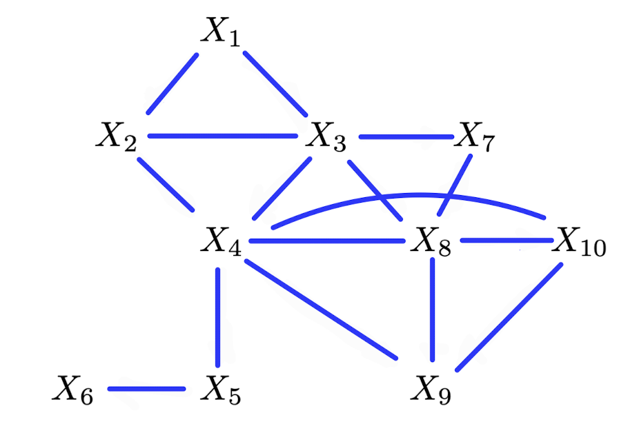

```{r setup, include=FALSE}
knitr::opts_chunk$set(echo = T, message = F, warning = F)

library(tidyverse)
library(ggplot2)
library(dagitty)
```

# Problem 1
Given the local Markov property for UGs,  
$X_i \indep X \backslash Cl(X_i,\mathcal{G})|Ne(X_i,\mathcal{G})$ and $X_i\not\sim X_j$  
$\Rightarrow X_i \indep X_j \cup (X\backslash Cl(X_i,\mathcal{G})\cup X_j)|Ne(X_i,\mathcal{G})$  
$\Rightarrow X_i \indep X_j|Ne(X_i,\mathcal{G})\cup (X\backslash Cl(X_i,\mathcal{G})\cup X_j)$ (by weak union)  
$\Rightarrow X_i \indep X_j|Ne(X_i,\mathcal{G})\cup (X\backslash Ne(X_i,\mathcal{G})\cup X_i \cup X_j)$  
$\Rightarrow X_i \indep X_j|X\backslash (X_i \cup X_j)$  $\Rightarrow X_i \indep X_j|X\backslash \{X_i,X_j\}$  
This is the pairwise Markov property. Therefore, we can conclude that local Markov property $\Rightarrow$ pairwise Markov property in undirected graph $\mathcal{G}$.

# Problem 2
{width=300px}  

(a) When factorizing by maximal clique, the joint distribution can be written as:    
$p(x)=\frac{1}{Z}\phi_{123}(x_1, x_2, x_3)\phi_{234}(x_2, x_3, x_4)\phi_{378}(x_3, x_7, x_8)\phi_{348}(x_3, x_4, x_8)\phi_{489}(x_4, x_8, x_9)\phi_{234}(x_8, x_9, x_{10})$  
$\phi_{45}(x_4, x_5)\phi_{56}(x_5, x_6)$  
There are 8 factor potentials. 

(b) When the scope has 3 variables, there are 3 parameters for each variable, 3 parameters for pairs, and 1 parameter for three-way interaction. When the scope has two variables, there are 2 parameters for single variable and 1 parameters for pairs. From (a), we have 6 scopes with 3 variables and 2 scopes with 2 variables. Therefore, there are $(3+3+1)\times6+(2+1)\times2=48$ variables in total.

(c) There are 10 variables and each can take on either 0 or 1, so there are $2^{10}=1024$ possible combinations. The joint distribution must sum to 1, and the last one will be determined automatically when all the other 9 variable are set. So $2^{10}-1=1023$ parameters would be required.   

(d) Factorization property in DAG $\mathcal{G}$:    
$p(x_1, x_2, ..., x_{10}) = \prod_{i=1}^{10} p(x_i \mid Pa(X_i, \mathcal{G}))$  
=$p(x_1)p(x_2|x_1)p(x_3|x_1)p(x_4|x_2, x_3)p(x_5|x_4)p(x_6|x_5)p(x_7|x_3)p(x_8|x_3,x_7)p(x_9|x_4,x_8,x_{10})p(x_{10}|x_8)$
When $x_i=1$, the probability can be written as $p(x_i=1|Pa(X_i,\mathcal{G}))$. The probability where $x_i=0$ can be obtained by $1-p(x_i=1|Pa(X_i,\mathcal{G}))$ so we can focus on the combination of the parents. 
By the above factorization formula, the required number of parameters are $2^0+2^1+2^1+2^2+2^1+2^1+2^1+2^2+2^3+2^1=29$.

# Problem 3
Independencies of $\mathcal{G}_1$:   
$A\perp _d B|\phi$, $B\perp _d D|\phi$, $D\perp _d C|\phi$, $C\perp _d A|\phi$, $A\perp _d D|\phi$, $B\perp _d C|\phi$   
Independencies of $\mathcal{G}_2$:  
$A\indep B|\{E, C, D\}$, $B\indep D|\{E, A, C\}$, $D\indep C|\{E, A, B\}$, $C\indep A|\{E, D, B\}$, $A\indep D|\{E, B, C\}$, $B\indep C|\{E, A, D\}$   
Independencies of $\mathcal{G}_3$:  
$A\perp _d B|E$, $B\perp _d D|E$, $D\perp _d C|E$, $C\perp _d A|E$, $A\perp _d D|E$, $B\perp _d C|E$  
Both BN and MRF models infer conditional independencies based on the absence of edges. In a BN, non-adjacent variables require some set $S$ (possibly empty) to make them independent, whereas in an MRF, non-adjacent variables are independent when conditioned on all remaining variables.   
Adding adjacency between $A$ and $B$ changes the independencies as follows.  
Independencies of $\mathcal{G}_1$:   
$A$ and $B$ are no longer independent, $B\perp _d D|\phi\text{ or }B\perp _d D|A$, $D\perp _d C|\phi\text{ or }D\perp _d C|\{A,B\}$,  
$C\perp _d A|\phi\text{ or }C\perp _d A|B$, $A\perp _d D|\phi\text{ or }A\perp _d D|B$, $B\perp _d C|\phi\text{ or }B\perp _d C|A$   
Independencies of $\mathcal{G}_2$:  
$A$ and $B$ are no longer independent. Aside from that, all the independencies remain the same.     
Independencies of $\mathcal{G}_3$:  
$A$ and $B$ are no longer independent.  
- When $B\rightarrow A$ is added, $A$ becomes a collider so all the independencies remain the same except $A$ and $B$.  
- When $B\leftarrow A$ is added:  
$B\perp _d D|\{E,A\}$, $D\perp _d C|\{E,A\}$, $C\perp _d A|\{E,A\}$, $A\perp _d D|\{E,A\}$, $B\perp _d C|\{E,A\}$ 

# Problem 4
Proof of $\mathbf{A}\perp_d\mathbf{B}|\mathbf{C} \text{ in DAG }\mathcal{G}\Rightarrow \mathbf{A}\indep \mathbf{B} |\mathbf{C} \text{ in } (\mathcal{G}_{An(\mathbf{A,B,C})})^m$:  
When $\mathbf{A}\perp_d\mathbf{B}|\mathbf{C} \text{ in DAG }\mathcal{G}$, all the paths from $\mathbf{A}$ to $\mathbf{B}$ through $\mathbf{C}$ should be blocked.    Noncollider in $\mathbf{C}$ makes the path non-active and collider in $\mathbf{C}$ makes the path active given $\mathbf{C}$ is in the conditioning set. If there are more than one node between $\mathbf{A}$ and $\mathbf{B}$, the path will be non-active because we cannot have nodes in $\mathbf{C}$ between $\mathbf{A}$ and $\mathbf{B}$ to be all colliders. In other words, $\mathbf{A}$ and $\mathbf{B}$ are d-connected only when there is a node in $\mathbf{C}$ that is a child of both $\mathbf{A}$ and $\mathbf{B}$. So, there is no node $c$ in $\mathbf{C}$ such that $A\rightarrow c \leftarrow B$ under $\mathbf{A}\perp_d\mathbf{B}|\mathbf{C}$. Additionally, there is no direct path between $\mathbf{A}$ and $\mathbf{B}$ in DAG $\mathcal{G}$. Thus, when constructing $(\mathcal{G}_{An(\mathbf{A,B,C})})^m$, the non-adjacency of $\mathbf{A}$ and $\mathbf{B}$ is maintained. Therefore, $\mathbf{A}\indep \mathbf{B} |\mathbf{C} \text{ in } (\mathcal{G}_{An(\mathbf{A,B,C})})^m$ holds.    

Proof of $\neg (\mathbf{A}\perp_d\mathbf{B}|\mathbf{C} \text{ in DAG }\mathcal{G})\Rightarrow \neg (\mathbf{A}\indep \mathbf{B} |\mathbf{C} \text{ in } (\mathcal{G}_{An(\mathbf{A,B,C})})^m)$:   
When $\mathbf{A}$ and $\mathbf{B}$ are not d-separated given $\mathbf{C}$, at least one path from $\mathbf{A}$ to $\mathbf{B}$ has to be active. As mentioned above, this is true only when there is node $c$ in $\mathbf{C}$ such that $A\rightarrow c \leftarrow B$. The moralization of DAG $\mathcal{G}$ will create a new edge between $\mathbf{A}$ and $\mathbf{B}$, so they will no longer be independent given $\mathbf{C}$ in $(\mathcal{G}_{An(\mathbf{A,B,C})})^m$.

Therefore, $\mathbf{A}\perp_d\mathbf{B}|\mathbf{C} \text{ in DAG }\mathcal{G}\text{ holds if and only if } \mathbf{A}\indep \mathbf{B} |\mathbf{C} \text{ in } (\mathcal{G}_{An(\mathbf{A,B,C})})^m$ holds. 


