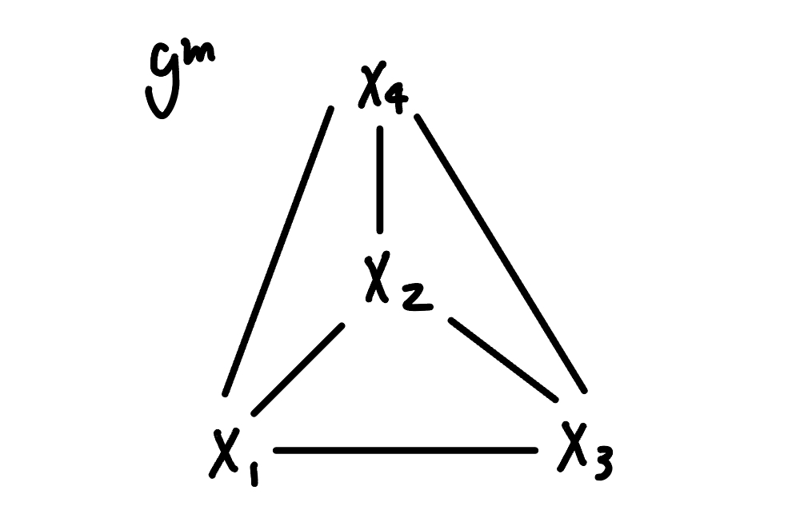
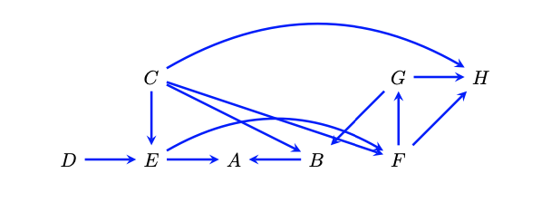

```{r setup, include=FALSE}
knitr::opts_chunk$set(echo = T, message = F, warning = F)

library(tidyverse)
library(ggplot2)
library(MASS)
library(gRim)
```

# Problem 1
$X\sim N(\mu, \Sigma)$ where $X=(X_1,...X_p)$  
The conditional distribution $X_i, X_j|X_s =x_s$ is still a Gaussian distribution with mean and covariance given by: $X_i, X_j|X_s =x_s\sim N(\mu_{ij|S},\Sigma_{ij|S})$  
 
$\left( \Sigma_{\{ijS\},\{ijS\}} \right)^{-1} = \begin{pmatrix}K_{\{i,j\},\{i,j\}} & K_{\{i,j\},S} \\K_{S,\{i,j\}} & K_S\end{pmatrix}$  
When $X_i \indep X_j|X_s$ is true, $K_{ij|S}=0$, which makes $\left( \Sigma_{\{ijS\},\{ijS\}} \right)^{-1}$ diagonal. Therefore, 
$X_i \indep X_j|X_s \Rightarrow (\Sigma_{\{ijS\},\{ijS\}})^{-1}_{ij}=0$ holds.  
When $(\Sigma_{\{ijS\},\{ijS\}})^{-1}_{ij}=0$ is true, $K_{ij|S}=(\Sigma_{ij|S})^{-1}=0$. 
$(\Sigma_{ij|S})^{-1}$ is the precision matrix for the conditional distribution $X_i, X_j|X_s =x_s$, so $X_i$ and $X_j$ are independent given $X_s$.  
Therefore, $X_i \indep X_j|X_s \Leftrightarrow (\Sigma_{\{ijS\},\{ijS\}})^{-1}_{ij}=0$.

# Problem 2
```{r}
# simulate data from a given MRF independence model
set.seed(123)
K <- cbind(c(10,7,7,0),c(7,20,0,7),c(7,0,30,7),c(0,7,7,40))
data <- as.data.frame(mvrnorm(n=10000,mu=c(0,0,0,0),Sigma=solve(K)))
colnames(data) <- c("X1","X2","X3","X4")
K
```

In the precision matrix, $K_{ij}=0$ implies that variable $X_i$ and $X_j$ are conditionally independent given all other variables. Given the precision matrix K, $K_{14}=K_{41}=0$ and $K_{23}=K_{32}=0$. Therefore the following conditional independencies are represented by $K$:  
$X_1\indep X_4|{X\backslash \{X_1,X_4\}}$  
$X_2\indep X_3|{X\backslash \{X_2,X_3\}}$
The corresponding graph is an undirected graph that has no edges between $X_1$ and $X_4$, and $X_2$ and $X_3$. All other pairs of variables are connected by edges.  
Now, I will verify the conditional independence constraints by using linear regression.   
$X_1\indep X_4|{X\backslash \{X_1,X_4\}}$:  
```{r}
# conditional independence of X1 and X4 given X2, X3
m14 = lm(X1 ~ X2 + X3 + X4, data = data)
summary(m14)
```
In this linear model, the coefficient of $X4$ turned out to be non-significant with p-value <0.05. 

$X_2\indep X_3|{X\backslash \{X_2,X_3\}}$:  
```{r}
# conditional independence of X2 and X3 given X1, X4
m23 = lm(X2 ~ X1 + X3 + X4, data = data)
summary(m23)
```
In this linear model, the coefficient of $X3$ turned out to be non-significant with p-value <0.05. 

Therefore, the conditional independencies are verified. 

The list of edges are $X_1-X_2$, $X_1-X_3$, $X_2-X_4$, $X_3-X_4$.
```{r}
# fit the model (estimate the precision matrix subject to the graph constraints)
glist <- list(
  c("X1", "X2"),
  c("X1", "X3"),
  c("X2", "X4"),
  c("X3", "X4")
)
ddd <- cov.wt(data, method="ML")
fit <- ggmfit(ddd$cov, ddd$n.obs, glist) # Estimate parameters using IPF
fit$K # estimated precision matrix
```
It appears that the model fitting worked because we can see that the estimated precision matrix has $K_{14}=K_{41}=0$ and $K_{23}=K_{32}=0$, and everything else non-zero, indicating that the above conditional independencies hold.

# Problem 3
```{r}
# Gaussian Bayesian Network model
# covariance matrix
set.seed(123)
Sig <- cbind(c(3,-1.4,0,0),c(-1.4,3,1.4,1.4),c(0,1.4,3,0),c(0,1.4,0,3))
data <- as.data.frame(mvrnorm(n=10000,mu=c(0,0,0,0),Sigma=Sig))
colnames(data) <- c("X1","X2","X3","X4")
```
DAG $\mathcal{G}$: $X_1\rightarrow X_2\leftarrow X_3$ and $X_4\rightarrow X_2$

(a)  
Given the model, correlation constraints are:  
$X_1\indep X_3|X_2$  
$X_1\indep X_4|X_2$  
$X_3\indep X_4|X_2$  

```{r}
# estimate the correlation 
cor(data)
```
We can see that the correlation between $X_1$ and $X_3$, $X_1$ and $X_4$, $X_3$ and $X_4$ are very close to zero.

(b)   
{width=300px}   
The precision matrix $K$ for $\mathcal{G}^m$ is 4 by 4 matrix with non-zero off-diagonal elements because all the pairs in the moralized graph are connected by edges. This indicates that all the pairs are conditionally dependent given the rest of other variables, meaning that they have non-zero partial correlations.  
Even though the covariance matrix $\Sigma$ shows zero direct covariances between some pairs of variables, the precision matrix $K$ reflects the conditional dependencies imposed by the moralized graph $\mathcal{G}^m$ where all pairs of variables are connected.

(c) 
```{r}
# estimate precision matrix K
estK = ggmfit(cov.wt(data, method = "ML")$cov, cov.wt(data, method = "ML")$n.obs, glist = glist)$K

# output estimated K
estK

# take the inverse of K
solve(estK)

# output the true covariance matrix
Sig
```

The estimated covariance matrix is mostly similar to true covariance matrix but differ slightly on $X_2$ and $X_3$, and  $X_1$ and $X_4$.

# Problem 4
```{r fig.width=3, fig.height=2}
library(dagitty)

# simulate 10000 observations from the following graph
g <- dagitty( "dag{ x <- u1; u1 -> m <- u2 ; u2 -> y }" )
plot(g)

# simulate data based on the DAG
set.seed(123)
n = 10000
u1 = rnorm(n)  
u2 = rnorm(n)  
x = u1 + rnorm(n)            
m = u1 + u2 + rnorm(n)  
y = u2 + rnorm(n) 

data <- data.frame(x = x, m = m, y = y)

# estimate the effect of x on y adjusting for m in a linear regression
m1 = lm(y ~ x + m, data = data)
summary(m1)

# 95% CI for the effect of x on y adjusting for m
confint(m1, "x", level = 0.95)
```

The estimate of X on Y adjusted for M is -0.19 with a 95% CI of (-0.21, -0.17), which is statistically significant.  

```{r}
# identify the sufficient adjustment set from dagitty
adjustmentSets(g, exposure = "x", outcome = "y")
```

The empty set was returned, which makes sense because M is a collider in the path X to Y and should not be adjusted.    
The new estimate and 95% CI can be obtained by the following:
```{r}
# estimate the effect of x on y adjusting for nothing in a linear regression
m2 = lm(y ~ x, data = data)
summary(m2)

# 95% CI for the effect of x on y adjusting for nothing
confint(m2, "x", level = 0.95)
```

The estimate of X on Y adjusted for nothing is 0.006 with a 95% CI of (-0.013, 0.025), which is not statistically significant.  
The first case implies that there is a causal effect of X on Y, and the second case implies the opposite. According to the DAG, adjusting for notation would be more appropriate when examining the effect of X on Y, and we confirmed that X has no causal effect on Y from the linear regression. The first case tells us that misadjustment can potentially create a non-existent causal effect between two variables and should be evaluated cautiously. 

# Problem 5
{width=300px}  

```{r fig.width=3, fig.height=2}
# construct the above as a daggity object
g <- dagitty( "dag{
               D -> E -> A <- B <- G -> H <- F; 
               F <- E <- C -> H; 
               B <- C -> F -> G
}" )

# simulate 10000 observations
set.seed(123)
sim = simulateSEM(g, N = 10000)
head(sim)

# identify the sufficient adjustment set from dagitty
adjustmentSets(g, exposure = "E", outcome = "F")
adjustmentSets(g, exposure = "B", outcome = "A")
```

Given the sufficient adjustment set, I will investigate the effect of E on F adjusting for C and the effect of B on A adjusting for {E}, {C, F}, {C, G} using the linear regression. 
```{r}
# linear models
# E on F
mEF = lm(F ~ E + C, data=sim) 
summary(mEF)

# B on A
mBA_E = lm(A ~ B + E, data=sim)
summary(mBA_E)

mBA_CF = lm(A ~ B + C + F, data=sim)
summary(mBA_CF)

mBA_CG = lm(A ~ B + C + G, data=sim)
summary(mBA_CG)
```

The estimates when adjusting for all other variables in the graph are as follows:
```{r}
# E on F
mEF_all = lm(F ~ E + A + B + C + D + G + H, data=sim) 
summary(mEF_all)

# B on A
mBA_all = lm(A ~ B + E + C + D + F + G + H, data=sim)
summary(mBA_all)
```

**Effect of E on F**  
The point estimate for E on F when adjusting for the set {C} is 0.4707 with a standard error of 0.0078, while adjusting for all other variables yields a point estimate of 0.4684 with a standard error of 0.0093. The point estimates are very similar, but the variance is slightly higher in the model adjusting for all other variables, likely due to increased noise from including unnecessary variables, which adds complexity without improving the estimate. 

**Effect of B on A**  
The point estimate for B on A when adjusting for the set {E} is -0.2440 with a standard error of 0.0096. When adjusting for the set {C, F}, the point estimate is -0.2421 with a standard error of 0.0102. Adjusting for the set {C, G} gives a point estimate of -0.2475 with a standard error of 0.0127. Finally, when adjusting for all other variables, the point estimate is -0.2474 with a standard error of 0.0127.   
All the point estimates are quite similar across the different adjustment sets. However, the variance is slightly higher in the model that adjusts for all other variables compared to the models using the sufficient adjustment sets, likely for the same reasons discussed earlier. Additionally, the model adjusted for the set {E} yields the lowest variance, likely because {E} is the minimal sufficient adjustment set for estimating the effect of B on A according to the DAG. As a result, it introduces less noise compared to the other models that adjust for more variables.